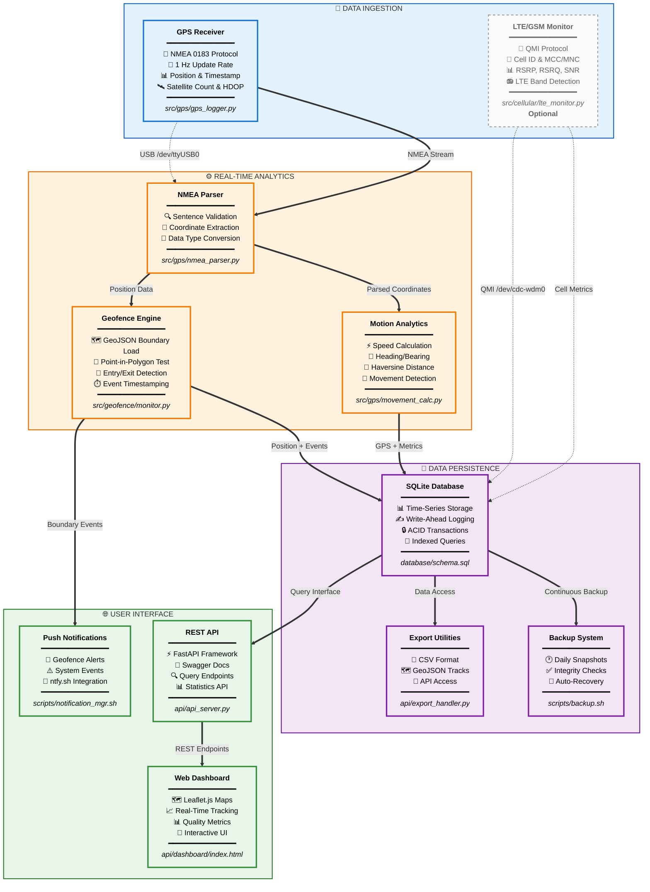

# Raspberry Pi GPS Data Logger
### Continuous GPS Logging, Motion Analytics, and Geofence Event Detection — with Optional LTE/GSM Contextual Metadata


---

## Objectives

### Primary Objectives
- Implement a GPS receiver system on a **Raspberry Pi 5** to record continuous location updates into a centralized database
- Calculate and log movement parameters such as **speed** and **heading** over time
- Define and enforce a **geofence** using a GeoJSON boundary file
- Trigger a **real-time notification** when the geofence is crossed

### Secondary Objective
- **LTE/GSM Logging:** Integrate a cellular metadata capture module to enrich GPS records with LTE/GSM network context (Cell ID, signal strength, band, and registration state) using a **Sierra Wireless EM7565/EM7511** modem

This allows correlation of spatial and signal data for contextualized geolocation analytics.

**All modules are containerized for reproducible deployment and long-term unattended operation.**

---

## Project Design Overview

### Core Functionality
- Continuously log **GPS NMEA sentences** from a USB GPS receiver connected via USB
- Parse and store **latitude, longitude, timestamp, altitude, speed, and heading** in a structured database
- Compute movement metrics using delta position and Haversine-based distance calculations
- Execute automatically on boot using a **systemd service** or **Docker container**

### Geofence and Notification Logic
- Load a **GeoJSON** file defining the geofence polygon or radius boundary
- Continuously validate current position against the geofence area
- Log **entry and exit events** with timestamps in the database
- Trigger a **real-time notification** (e.g., via ntfy.sh) upon boundary violation

### Optional: LTE/GSM Metadata Capture
- Interface with a **Sierra Wireless EM7565/EM7511 LTE modem** through AT or QMI commands
- Record contextual **cellular metrics**, including:
  - Cell ID
  - MCC/MNC (Mobile Country & Network Code)
  - RSRP (Signal Strength in dBm)
  - LTE Band / Radio Access Type
- Associate LTE metadata with each GPS timestamp for environmental context and future signal-coverage mapping

---

## System Architecture


### Architecture Summary

The system follows a **seven-layer architecture** designed for reliability and autonomous operation:

**Layer 1 - Hardware:** GPS receiver and optional LTE modem connect via USB to the Raspberry Pi 5, providing raw NMEA sentences and cellular metrics.

**Layer 2 - Operating System:** Ubuntu 24.04 LTS manages device interfaces and provides systemd service orchestration for automatic startup and recovery.

**Layer 3 - Container Infrastructure:** Docker Compose isolates three services (GPS logger, LTE monitor, API server) with independent health checks and restart policies.

**Layer 4 - Application Services:** Python 3.12 applications parse NMEA data, calculate motion parameters, validate geofence boundaries, and collect cellular metadata.

**Layer 5 - Data Persistence:** SQLite with Write-Ahead Logging (WAL) provides crash-resistant storage, surviving hard power loss without corruption.

**Layer 6 - Monitoring & Recovery:** Self-healing mechanisms detect failures and restart containers within 30 seconds, with automated backups and integrity checks.

**Layer 7 - Network & Communication:** REST API provides programmatic access, web dashboard enables visualization, and ntfy.sh sends real-time geofence alerts.

---

## System Features & Data Flow



### Data Architecture Layers

The system processes data through seven distinct architectural layers:

**1. Ingestion Layer** — GPS and LTE data collection through USB serial interfaces, providing raw NMEA sentences and cellular metrics.

**2. Analytics Layer** — Real-time computation of movement parameters (speed, heading, bearing) using Haversine formulas and position deltas.

**3. Persistence Layer** — Time-series data storage in SQLite with Write-Ahead Logging for crash resistance and ACID transaction guarantees.

**4. Geofence Layer** — Spatial boundary validation using Shapely point-in-polygon algorithms against GeoJSON-defined boundaries.

**5. Notification Layer** — REST-based event triggers to external services (ntfy.sh) when geofence violations or system events occur.

**6. Container Layer** — All components modularized and orchestrated via Docker Compose with independent health checks and restart policies.

**7. Cellular Context Layer** *(Optional)* — Secondary ingestion pipeline for LTE/GSM network metrics, enriching GPS records with cellular context.

### Feature Layer Details

#### 📡 Data Ingestion Layer
Primary input sources for real-time geolocation data collection.

| Component | Purpose | Technology | Status |
|-----------|---------|------------|--------|
| GPS Receiver | Continuous position tracking | NMEA 0183 @ 4800 baud | ✅ Required |
| LTE Monitor | Cellular network metadata | QMI protocol via libqmi | ⚠️ Optional |

**References:** [`src/gps/gps_logger.py`](src/gps/gps_logger.py) · [`src/cellular/lte_monitor.py`](src/cellular/lte_monitor.py) · [Hardware Setup Guide](docs/HARDWARE_SETUP.md)

#### ⚙️ Real-Time Analytics Layer
Processes raw sensor data into actionable intelligence and events.

| Component | Purpose | Algorithm | Output |
|-----------|---------|-----------|--------|
| NMEA Parser | Decode GPS sentences | Regex + validation | Structured coordinates |
| Motion Analytics | Calculate movement | Haversine formula | Speed, heading, distance |
| Geofence Engine | Boundary validation | Point-in-polygon (Shapely) | Entry/exit events |

**References:** [`src/gps/nmea_parser.py`](src/gps/nmea_parser.py) · [`src/gps/movement_calc.py`](src/gps/movement_calc.py) · [`src/geofence/geofence_monitor.py`](src/geofence/geofence_monitor.py) · [Geofencing Guide](docs/GEOFENCING.md)

#### 💾 Data Persistence Layer
Reliable, crash-resistant storage with automated maintenance.

| Component | Purpose | Technology | Frequency |
|-----------|---------|------------|-----------|
| SQLite Database | Time-series storage | WAL mode + FULL sync | Continuous |
| Backup System | Data redundancy | Automated snapshots | Daily @ 3 AM |
| Export Utilities | Data extraction | CSV/GeoJSON converters | On-demand |

**Database Tables:** `gps_data` (position, speed, heading) · `cell_observations` (LTE metrics) · `geofence_events` (boundary crossings)

**References:** [`database/schema.sql`](database/schema.sql) · [`scripts/backup.sh`](scripts/backup.sh) · [`api/export_handler.py`](api/export_handler.py)

#### 🌐 User Interface Layer
Access points for data visualization, querying, and alerting.

| Component | Purpose | Framework | Access |
|-----------|---------|-----------|--------|
| REST API | Programmatic access | FastAPI + Uvicorn | Port 8000 |
| Web Dashboard | Visual tracking | Leaflet.js + HTML5 | `http://[pi]:8000` |
| Push Notifications | Real-time alerts | ntfy.sh | Mobile/Desktop |

**API Endpoints:** `/api/gps/latest` · `/api/gps/track` · `/api/stats/summary` · `/docs` (Swagger)

**References:** [`api/api_server.py`](api/api_server.py) · [`api/dashboard/index.html`](api/dashboard/index.html) · [`scripts/notification_manager.sh`](scripts/notification_manager.sh)

### Data Flow Summary

```
GPS Receiver → NMEA Parser → Motion Analytics → SQLite Database → REST API → Dashboard
                          ↓                                      ↓
                    Geofence Engine → Push Notifications    Export Tools
                    
LTE Modem → Cell Metrics → SQLite Database (optional path)
```

**Flow Characteristics:**
- **Primary Path** (solid lines): Required GPS data pipeline from sensor to storage to user interface
- **Optional Path** (dashed lines): LTE metadata enhancement for cellular context correlation
- **Real-Time Processing**: <1 second latency from GPS fix to database commit
- **Crash Resilient**: WAL mode protects against corruption during sudden power loss
- **Self-Healing**: Automatic container restart on failure with <30 second recovery time

---

## Feature Priorities

#### 🔴 Mission Critical (P0) - Primary Objectives
Core GPS tracking and geofence alerting capabilities.

| Feature | Description | Implementation |
|---------|-------------|----------------|
| 📍 **GPS Position Logging** | Continuous NMEA parsing and coordinate extraction | `src/gps/gps_logger.py` |
| ⚡ **Speed/Heading Calc** | Haversine-based motion analytics from position deltas | `src/gps/movement_calc.py` |
| 🗺️ **Geofence Detection** | Point-in-polygon validation against GeoJSON boundaries | `src/geofence/monitor.py` |
| 🔔 **Push Notifications** | Real-time alerts via ntfy.sh on boundary violations | `scripts/notification_mgr.sh` |

#### 🟡 Enhanced Capabilities (P1) - Secondary Objectives
Cellular metadata collection and data access interfaces.

| Feature | Description | Implementation |
|---------|-------------|----------------|
| 📶 **LTE/GSM Metadata** | Cell ID, RSRP, RSRQ, band logging via QMI protocol | `src/cellular/lte_monitor.py` |
| 🌐 **REST API** | FastAPI endpoints for data access and statistics | `api/api_server.py` |
| 📊 **Dashboard Viz** | Interactive Leaflet.js map with real-time tracking | `api/dashboard/` |
| 📄 **Data Export** | CSV/GeoJSON export utilities for external analysis | `api/export_handler.py` |

#### 🔵 Infrastructure (P2) - Reliability Foundation
System-level capabilities ensuring autonomous operation.

| Feature | Description | Implementation |
|---------|-------------|----------------|
| 🐳 **Docker Containers** | Modular service isolation and orchestration | `docker-compose.yml` |
| 💾 **Auto Backups** | Daily database snapshots with integrity checks | `scripts/backup.sh` |
| 🔄 **Self-Healing** | Automatic container restart on failure (<30s recovery) | Health checks + systemd |
| 💥 **Crash Tolerance** | SQLite WAL + ext4 optimization for hard shutdowns | System configuration |

---

## Hardware Requirements

### Core Components

| Component | Model/Specification | Details |
|-----------|---------------------|---------|
| **Single Board Computer** | Raspberry Pi 5 (8GB RAM) | ARM Cortex-A76 quad-core @ 2.4GHz<br/>8GB LPDDR4X-4267 SDRAM<br/>Dual 4Kp60 HDMI display output<br/>2× USB 3.0, 2× USB 2.0 ports<br/>Gigabit Ethernet, WiFi 6, Bluetooth 5.0 |
| **Primary Storage** | SanDisk 128GB microSD Card | Class 10, UHS-I (U3)<br/>Formatted ext4 with optimizations<br/>`noatime,commit=60,data=ordered` |
| **Power Supply** | Official Raspberry Pi 27W USB-C | 5.1V / 5A output<br/>Vehicle adapter: 12V DC to USB-C |
| **Enclosure** | Raspberry Pi 5 Case | Passive cooling recommended<br/>Ventilation for continuous operation |

### GPS Hardware

| Component | Specification |
|-----------|---------------|
| **GPS Receiver** | USB GPS with Prolific PL2303 chipset |
| **Protocol** | NMEA 0183 |
| **Baud Rate** | 4800 |
| **Chipset** | SiRF Star IV or equivalent |
| **Update Rate** | 1 Hz (1 position/second) |
| **Cold Start** | 45-60 seconds |
| **Accuracy** | 2.5m CEP (typical) |
| **Satellites** | GPS + GLONASS support |
| **Antenna** | Active GPS antenna (recommended for vehicle) |
| **Device Path** | `/dev/ttyUSB0`<br/>Symlink: `/dev/serial/by-id/usb-Prolific_Technology_Inc._USB-Serial_Controller_*` |
| **Connection** | USB 2.0/3.0 |
| **Fix Requirements** | 4+ satellites for 2D fix<br/>5+ satellites for 3D fix with altitude |

### LTE/GSM Hardware *(Optional)*

| Component | Specification |
|-----------|---------------|
| **Modem** | Sierra Wireless EM7511 |
| **Form Factor** | M.2 3042 (requires USB adapter) |
| **Interface** | USB 3.0 via M.2 to USB adapter |
| **Carrier** | T-Mobile (tested), unlocked for other carriers |
| **Bands** | LTE: B2, B4, B5, B7, B12, B13, B25, B26, B41, B66, B71<br/>UMTS/HSPA+: B1, B2, B4, B5, B8 |
| **Protocols** | QMI (primary), AT commands (secondary) |
| **QMI Device** | `/dev/cdc-wdm0` |
| **AT Interface** | `/dev/ttyUSB2` |
| **Data Collection** | Cell ID, MCC/MNC, PCI, RSRP, RSRQ, SNR, LTE Band |

### Optional Components

| Component | Purpose | Notes |
|-----------|---------|-------|
| **NVMe SSD** | Long-term archive storage | 256GB+ recommended<br/>Requires PCIe HAT for Pi 5<br/>Not critical for operation |
| **External GPS Antenna** | Improved GPS reception | SMA connector, active antenna<br/>Useful for vehicle installations |
| **LTE Antenna** | Enhanced cellular signal | Dual antenna for EM7511<br/>Improves signal in weak coverage areas |
| **UPS/Battery Pack** | Graceful shutdown buffer | Prevents data loss on power cut<br/>5-10 minute runtime sufficient |

### Tested Configuration

This system has been validated with the following production setup:

- **Operating System**: Ubuntu 24.04 LTS (64-bit)
- **Kernel**: Linux 6.8+
- **Docker**: 27.x
- **Python**: 3.12
- **Deployment**: Mobile vehicle installation
- **Runtime**: 24/7 continuous operation
- **Environment**: Hard shutdown tolerance (no graceful power-off)

---

## Quick Start

### 1. Clone Repository
```bash
git clone https://github.com/cramos93/Raspberry-Pi-GPS-Cellular-Data-Logger.git
cd Raspberry-Pi-GPS-Cellular-Data-Logger
```

### 2. Install Dependencies
```bash
# System packages
sudo apt update
sudo apt install -y python3-pip sqlite3 docker.io docker-compose

# Python packages
pip3 install pyserial shapely pyyaml requests
```

### 3. Configure
```bash
# Copy configuration template
cp config/config.yaml.example config/config.yaml

# Edit with your settings
nano config/config.yaml
```

### 4. Deploy with Docker
```bash
# Start all services
docker compose up -d

# Check status
docker ps

# View logs
docker logs rpi-gps-logger --follow
```

### 5. Access Dashboard
Open browser: `http://[raspberry-pi-ip]:8000`

---

## Docker Architecture

### Container Stack

```yaml
services:
  gps-logger:
    # Primary Task: GPS Data Collection
    # - Parses NMEA sentences
    # - Calculates speed and heading
    # - Writes to SQLite database
    devices: [GPS_DEVICE]
    restart: unless-stopped
    
  lte-monitor:
    # Secondary Task: Cellular Metadata Collection
    # - Collects signal metrics via QMI
    # - Logs Cell ID, RSRP, RSRQ, Band
    # - Requires ModemManager masked
    privileged: true
    restart: unless-stopped
    
  api-server:
    # Provides REST API and dashboard
    # - FastAPI endpoints
    # - Real-time map visualization
    # - Data export utilities
    ports: ["8000:8000"]
    restart: unless-stopped
```

**Health Checks:**
- GPS Logger: Database connectivity every 60s
- LTE Monitor: QMI device check every 60s
- API Server: HTTP endpoint check every 30s

**Auto-Recovery:**
- Containers restart automatically on failure
- Systemd service restarts Docker Compose
- Recovery time: <30 seconds

---

## Database Schema

### gps_data (Primary Table)
```sql
CREATE TABLE gps_data (
    id INTEGER PRIMARY KEY,
    timestamp TEXT NOT NULL,
    latitude REAL NOT NULL,
    longitude REAL NOT NULL,
    altitude REAL,
    speed REAL,
    heading REAL,
    satellites INTEGER,
    hdop REAL,
    fix_quality INTEGER,
    created_at TIMESTAMP DEFAULT CURRENT_TIMESTAMP
);
```

### cell_observations (LTE Metadata - Optional)
```sql
CREATE TABLE cell_observations (
    id INTEGER PRIMARY KEY,
    ts INTEGER NOT NULL,
    cell_id TEXT,
    rsrp REAL,
    rsrq REAL,
    snr REAL,
    band TEXT,
    pci INTEGER,
    created_at TIMESTAMP DEFAULT CURRENT_TIMESTAMP
);
```

### geofence_events (Boundary Crossings)
```sql
CREATE TABLE geofence_events (
    id INTEGER PRIMARY KEY,
    timestamp TEXT NOT NULL,
    event_type TEXT NOT NULL,
    fence_name TEXT,
    latitude REAL,
    longitude REAL,
    created_at TIMESTAMP DEFAULT CURRENT_TIMESTAMP
);
```

**Database Configuration:**
- Mode: WAL (Write-Ahead Logging)
- Sync: FULL
- Location: `/home/user/gps-data/gps_data.db`

---

## System Resilience

### Hard Shutdown Tolerance
The system is designed for mobile vehicle deployment where power can be cut without warning:

- **SQLite WAL Mode:** Protects against corruption during sudden power loss
- **Filesystem Optimization:** `ext4` with `noatime,commit=60,data=ordered`
- **RAM Logging:** Active logs in tmpfs, synced every 15 minutes
- **USB Reset Service:** Ensures devices initialize properly on boot

**Result:** Survives hard power loss mid-write without data corruption

### Self-Healing Mechanisms
- Container auto-restart on failure
- Health monitoring every 15 minutes
- Database integrity checks hourly
- Automatic backup restoration
- Recovery time: <30 seconds

### SD Card Longevity
- RAM-based logging (90% write reduction)
- Smart backups (only on changes)
- `noatime` mount option
- **Result:** Years of lifespan vs. months

---

## Geofencing

### Task Implementation
1. **Define Boundary:** Create GeoJSON file with polygon coordinates
2. **Load Configuration:** Geofence monitor reads boundary at startup
3. **Continuous Validation:** Check GPS position every 60 seconds
4. **Event Detection:** Log entry/exit when boundary is crossed
5. **Trigger Notification:** Send push alert via ntfy.sh

### GeoJSON Configuration
```json
{
  "type": "Feature",
  "properties": {"name": "Home Zone"},
  "geometry": {
    "type": "Polygon",
    "coordinates": [[
      [-77.0369, 38.8951],
      [-77.0369, 38.9051],
      [-77.0269, 38.9051],
      [-77.0269, 38.8951],
      [-77.0369, 38.8951]
    ]]
  }
}
```

Save to: `config/geofence.geojson`

**Create boundaries easily:** Use [geojson.io](https://geojson.io) to draw and export

**See:** [Geofencing Guide](docs/GEOFENCING.md) for complete implementation details

---

## REST API

### Base URL
```
http://[raspberry-pi-ip]:8000
```

### Endpoints

| Endpoint | Description |
|----------|-------------|
| `GET /` | Interactive dashboard |
| `GET /docs` | Swagger API documentation |
| `GET /api/gps/latest` | Latest GPS position |
| `GET /api/gps/track` | GPS track (GeoJSON) |
| `GET /api/stats/summary` | System statistics |
| `GET /api/analysis/track-quality` | GPS quality metrics |

### Example: Latest Position
```bash
curl http://192.168.11.143:8000/api/gps/latest | jq
```

```json
{
  "latitude": 39.1234,
  "longitude": -78.5678,
  "altitude": 125.5,
  "speed": 45.2,
  "heading": 135.0,
  "satellites": 8,
  "timestamp": "2025-11-24T10:30:00Z"
}
```

---

## System Services

### Systemd Integration

**Main Service:** `gps-tracker.service`
```ini
[Unit]
Description=GPS Tracker Service
After=docker.service network-online.target

[Service]
Type=simple
User=pi
WorkingDirectory=/home/pi/gps-tracker
ExecStart=/usr/bin/docker compose up
Restart=always
RestartSec=10

[Install]
WantedBy=multi-user.target
```

**USB Reset Service:** `usb-reset-boot.service`
- Resets USB devices on boot
- Ensures GPS and modem initialize correctly
- Runs before main service starts

**Enable auto-start:**
```bash
sudo systemctl enable gps-tracker.service
sudo systemctl start gps-tracker.service
```

---

## Monitoring

### Health Checks
- Container health: Every 30-60 seconds
- System health: Every 15 minutes
- Database integrity: Hourly + on boot
- Disk space: Every 6 hours

### Automated Backups
- Daily at 3 AM
- Retention: Last 10 backups
- Location: `/home/user/gps-data/backups/`

### Notifications
Push alerts via [ntfy.sh](https://ntfy.sh):
- Geofence boundary crossings (primary objective)
- System startup
- Container failures
- Low disk space warnings

**Configure:** Add your ntfy.sh topic in `config/config.yaml`

---

## Project Structure & Documentation

```
raspberry-pi-gps-cellular-logger/
│
├── 📦 Container Configuration
│   ├── docker-compose.yml          Service orchestration
│   ├── Dockerfile.gps              GPS logger container
│   ├── Dockerfile.lte              LTE monitor container
│   ├── Dockerfile.api              API server container
│   └── .env                        Environment variables
│
├── 🐍 Source Code
│   ├── src/
│   │   ├── gps/
│   │   │   ├── gps_logger.py       GPS data collector
│   │   │   ├── nmea_parser.py      NMEA sentence parser
│   │   │   └── movement_calc.py    Motion analytics
│   │   ├── cellular/
│   │   │   ├── lte_monitor.py      LTE signal monitor (optional)
│   │   │   └── qmi_interface.py    QMI protocol handler
│   │   └── geofence/
│   │       └── geofence_monitor.py Boundary validator
│   │
│   └── api/
│       ├── api_server.py           FastAPI REST server
│       ├── export_handler.py       Data export utilities
│       └── dashboard/
│           └── index.html          Web dashboard
│
├── ⚙️ Configuration
│   ├── config/
│   │   ├── config.yaml.example     Configuration template
│   │   └── geofence.geojson        Boundary definitions
│   │
│   └── database/
│       └── schema.sql              SQLite schema
│
├── 🔧 System Scripts
│   ├── scripts/
│   │   ├── install.sh              System installation
│   │   ├── usb_reset.sh            USB device reset
│   │   ├── backup.sh               Database backup
│   │   └── notification_mgr.sh     Push notification handler
│   │
│   └── systemd/
│       ├── gps-tracker.service     Main service
│       └── usb-reset-boot.service  Boot USB reset
│
└── 📚 Documentation
    ├── README.md                   This file
    │
    ├── docs/
    │   ├── INSTALLATION.md         Complete setup guide
    │   ├── HARDWARE_SETUP.md       GPS and LTE wiring
    │   ├── CONFIGURATION.md        All settings explained
    │   ├── USAGE.md                Operation guide
    │   ├── GEOFENCING.md           Creating boundaries
    │   ├── DATA_EXPORT.md          CSV, GeoJSON export
    │   ├── API.md                  REST API reference
    │   └── TROUBLESHOOTING.md      Common issues and fixes
    │
    └── examples/
        ├── docker-compose.example.yml
        ├── geofence.example.geojson
        └── config.example.yaml
```

### Key Documentation Files

#### Setup & Configuration
- **[Installation Guide](docs/INSTALLATION.md)** - Complete system setup from scratch
- **[Hardware Setup](docs/HARDWARE_SETUP.md)** - GPS and LTE wiring diagrams
- **[Configuration Reference](docs/CONFIGURATION.md)** - All settings explained with examples

#### Operation
- **[Usage Guide](docs/USAGE.md)** - Running and managing the system
- **[Geofencing Setup](docs/GEOFENCING.md)** - Creating and testing boundaries
- **[Data Export](docs/DATA_EXPORT.md)** - CSV, GeoJSON export utilities

#### Development
- **[API Reference](docs/API.md)** - Complete REST API documentation
- **[Troubleshooting](docs/TROUBLESHOOTING.md)** - Common issues and solutions

#### Container Files
- **[docker-compose.yml](docker-compose.yml)** - Multi-container orchestration
- **[Dockerfile.gps](Dockerfile.gps)** - GPS logger image
- **[Dockerfile.lte](Dockerfile.lte)** - LTE monitor image (optional)
- **[Dockerfile.api](Dockerfile.api)** - API server image

**Last Updated:** November 2025
