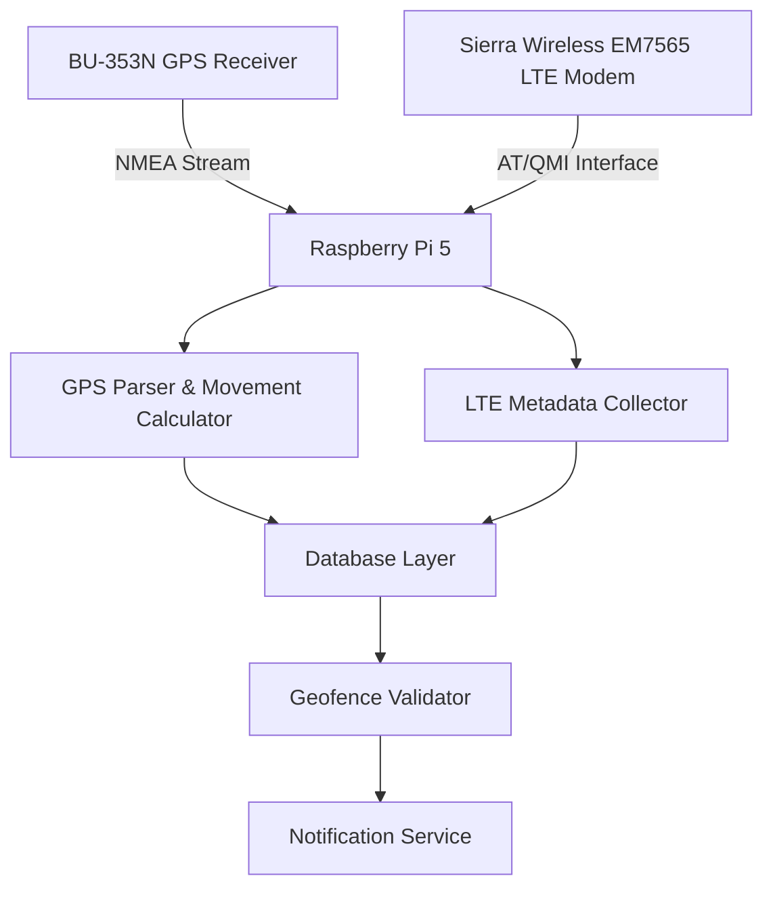

<!DOCTYPE html>
<html lang="en">
<head>
    <meta charset="UTF-8">
    <meta name="viewport" content="width=device-width, initial-scale=1.0">
    <title>GPS Tracker README</title>
    
</head>
<body>
    

        <h1>📋 Copy Your README Content</h1>
        <button class="copy-btn" onclick="copyContent()">Copy to Clipboard</button>
        <pre id="content"># **Raspberry Pi GPS–Cellular Data Logger**
### Continuous GPS Logging, Motion Analytics, and Geofence Event Detection with LTE Contextual Metadata
---
## **1. Objective**
The purpose of this project is to design and implement an **automated GPS telemetry system** on a **Raspberry Pi 5** that continuously records positional data, computes movement parameters (speed and heading), and enforces a **geofence boundary** defined by a GeoJSON file.  
When a boundary is crossed, the system generates a **real-time push notification**.  
An optional **cellular metadata capture module** enhances each record with LTE network context — including Cell ID, signal strength, and frequency band — by interfacing with a **Sierra Wireless EM7565/EM7511** LTE modem.  
All modules are containerized for reproducible deployment and long-term unattended operation.
---
## **2. Project Design Overview**
### **Core Functionality**
- Continuously log **GPS NMEA sentences** from a **BU-353N GPS puck** connected via USB.  
- Parse and store **latitude, longitude, timestamp, altitude, speed, and heading** in a structured database.  
- Compute movement metrics using delta position and Haversine-based distance calculations.  
- Execute automatically on boot using a **systemd service** or **Docker container**.  
### **Geofence and Notification Logic**
- Load a **GeoJSON file** defining the geofence polygon or radius boundary.  
- Continuously validate current position against the geofence area.  
- Log **entry and exit events** with timestamps in the database.  
- Trigger a **real-time notification** (e.g., via [ntfy.sh](https://ntfy.sh)) upon boundary violation.
### **Cellular Metadata Capture (Optional)**
- Interface with **Sierra Wireless EM7565/EM7511 LTE modem** through AT or QMI commands.  
- Log contextual LTE parameters such as:
  - Cell ID  
  - MCC/MNC (Network and Country Code)  
  - RSRP (Signal Strength in dBm)  
  - LTE Band / Technology Type  
- Associate LTE metadata with each GPS timestamp for contextualized signal-environment mapping.  
### **Data Architecture**
1. **Ingestion Layer** – GPS and LTE data collection through serial interfaces.  
2. **Analytics Layer** – Movement computation (speed, heading, bearing).  
3. **Persistence Layer** – Time-series data storage (SQLite/PostgreSQL).  
4. **Geofence Layer** – Spatial boundary validation using Shapely and GeoJSON.  
5. **Notification Layer** – REST-based event trigger to external services.  
6. **Container Layer** – All components modularized and orchestrated via Docker Compose.
---
## **3. Requirements**
### **Hardware**
- **Raspberry Pi 5 (8 GB)** with Raspberry Pi OS (Bookworm)
- **GlobalSat BU-353N GPS Receiver (USB, SiRF Star IV)**
- **Sierra Wireless EM7565 / EM7511 LTE Modem** (Optional, USB interface)
- *(Optional)* **Panda PAU09 Wi-Fi Adapter** for network survey expansion
### **Software**
- **Python 3.x**
  - Libraries: `pyserial`, `gps`, `geojson`, `shapely`, `pyproj`, `sqlite3`, `requests`, `datetime`, `re`
- **Database:** SQLite (default) or PostgreSQL
- **Docker & Docker Compose** for full containerized deployment
- **Notification Service:** [ntfy](https://ntfy.sh) or equivalent push API
---
### **System Architecture Diagram**

For more information, visit [https://docs.github.com/en/get-started/writing-on-github/working-with-advanced-formatting/creating-diagrams](https://docs.github.com/en/get-started/writing-on-github/working-with-advanced-formatting/creating-diagrams)
---</pre>
    

    
</body>
</html>
