```mermaid
graph TB
    %% ---------- Hardware ----------
    GPS["📡 GPS Receiver<br/>GlobalSat BU-353N<br/><i>Hardware</i>"]
    LTE["📶 LTE Modem EM7565/EM7511<br/><i>Hardware · Optional</i>"]

    GPS -->|USB/NMEA| PI{{"💻 RASPBERRY PI 5<br/>Central Processing Unit<br/><i>Software Runtime</i>"}}
    LTE -.->|USB/AT or QMI| PI

    %% ---------- Software Ingest ----------
    PI ==>|Primary Path| PARSE["⚙️ GPS Parser &<br/>Movement Calculator"]
    PI -.->|"Optional Path"| META["📡 LTE/GSM Metadata<br/>Parser & Collector"]

    %% ---------- Core Processing (hexagonal symbol, unique) ----------
    PARSE ==> CORE{{"🎯 CORE PROCESSING ENGINE<br/>━━━━━━━━━━━━━━<br/>📍 Location Tracking<br/>⚡ Speed Calculation<br/>🧭 Heading Analysis<br/>📶 Cellular Logging (LTE/GSM)<br/>📊 Parameter Logging<br/>━━━━━━━━━━━━━━"}}
    META -.->|"Cell Metrics Processing"| CORE

    %% ---------- Database & Outputs ----------
    CORE ==>|Primary Data Flow| DB[("💾 Time-Series Database<br/>SQLite / PostgreSQL")]
    DB -->|"Export"| FILES["📁 File Outputs<br/>CSV / GeoJSON<br/>Merged GPS + Cellular Data"]

    %% ---------- Geofence & Notification (optional feature branch) ----------
    DB -.->|"Feature Branch"| FENCE["🗺️ Geofence Validator<br/>GeoJSON · Optional"]
    FENCE -.->|"On Violation"| NOTIFY["🔔 Push Notification<br/>ntfy.sh · Optional"]

    %% ---------- Styles ----------
    %% Hardware = Grey; Export = Light Blue
    classDef hardware fill:#e0e0e0,stroke:#424242,stroke-width:2px,color:#000
    classDef hardwareOpt fill:#eeeeee,stroke:#616161,stroke-width:2px,stroke-dasharray:5 5,color:#555
    classDef central fill:#4caf50,stroke:#1b5e20,stroke-width:4px,color:#000
    classDef core fill:#ffe082,stroke:#f9a825,stroke-width:3px,color:#000
    classDef software fill:#f3e5f5,stroke:#7b1fa2,stroke-width:2px,color:#000
    classDef softwareOpt fill:#f3e5f5,stroke:#7b1fa2,stroke-width:2px,stroke-dasharray:5 5,color:#666
    classDef database fill:#ffb74d,stroke:#e64a19,stroke-width:2px,color:#000
    classDef export fill:#bbdefb,stroke:#1565c0,stroke-width:2px,color:#000
    classDef optional fill:#fff3e0,stroke:#ef6c00,stroke-width:2px,stroke-dasharray:5 5,color:#666

    %% ---------- Assign Classes ----------
    class GPS hardware
    class LTE hardwareOpt
    class PI central
    class PARSE software
    class META softwareOpt
    class CORE core
    class DB database
    class FILES export
    class FENCE,NOTIFY optional
```

# **Raspberry Pi GPS Data Logger**
### Continuous GPS Logging, Motion Analytics, and Geofence Event Detection — with Optional LTE/GSM Contextual Metadata


---

## **Objectives**

### **Primary Objectives**
- Implement a GPS receiver system on a **Raspberry Pi 5** to record continuous location updates into a centralized database
- Calculate and log movement parameters such as **speed** and **heading** over time
- Define and enforce a **geofence** using a GeoJSON boundary file
- Trigger a **real-time notification** when the geofence is crossed

### **Secondary Objective**
- **LTE/GSM Logging:** Integrate a cellular metadata capture module to enrich GPS records with LTE/GSM network context (Cell ID, signal strength, band, and registration state) using a **Sierra Wireless EM7565/EM7511** modem

This allows correlation of spatial and signal data for contextualized geolocation analytics.

**All modules are containerized for reproducible deployment and long-term unattended operation.**

---

## **Project Design Overview**

### **Core Functionality**
- Continuously log **GPS NMEA sentences** from a **GlobalSat BU-353N GPS puck** connected via USB
- Parse and store **latitude, longitude, timestamp, altitude, speed, and heading** in a structured database
- Compute movement metrics using delta position and Haversine-based distance calculations
- Execute automatically on boot using a **systemd service** or **Docker container**

### **Geofence and Notification Logic**
- Load a **GeoJSON** file defining the geofence polygon or radius boundary
- Continuously validate current position against the geofence area
- Log **entry and exit events** with timestamps in the database
- Trigger a **real-time notification** (e.g., via ntfy.sh) upon boundary violation

### **Optional: LTE/GSM Metadata Capture**
- Interface with a **Sierra Wireless EM7565/EM7511 LTE modem** through AT or QMI commands
- Record contextual **cellular metrics**, including:
  - Cell ID
  - MCC/MNC (Mobile Country & Network Code)
  - RSRP (Signal Strength in dBm)
  - LTE Band / Radio Access Type
- Associate LTE metadata with each GPS timestamp for environmental context and future signal-coverage mapping

### **Data Architecture**
1. **Ingestion Layer** — GPS and LTE data collection through serial interfaces
2. **Analytics Layer** — Movement computation (speed, heading, bearing)
3. **Persistence Layer** — Time-series data storage (SQLite/PostgreSQL)
4. **Geofence Layer** — Spatial boundary validation using Shapely and GeoJSON
5. **Notification Layer** — REST-based event trigger to external services
6. **Container Layer** — All components modularized and orchestrated via Docker Compose
7. **Optional: Cellular Context Layer** — Secondary ingestion pipeline for LTE/GSM network metrics

---

## **System Architecture**



**Seven-Layer Architecture:**
1. **Hardware Layer** - GPS receiver (GlobalSat BU-353N) + LTE modem (Sierra Wireless EM7511)
2. **Operating System** - Ubuntu 24.04 LTS with systemd service management
3. **Container Infrastructure** - Docker Compose orchestration (3 services)
4. **Application Services** - Python 3.12 data collectors and parsers
5. **Data Persistence** - SQLite with Write-Ahead Logging (crash-resistant)
6. **Monitoring & Recovery** - Self-healing with automatic recovery (<30 sec)
7. **Network & Communication** - REST API, ntfy.sh notifications, geofence alerts

---

## **System Features & Data Flow**

```mermaid
graph TB
    subgraph INPUTS["📡 DATA INGESTION LAYER"]
        direction TB
        GPS_IN["<b>GPS Receiver</b><br/>━━━━━━━━━━━━━━━<br/>📍 NMEA 0183 Protocol<br/>🔄 1 Hz Update Rate<br/>📊 Position & Timestamp<br/>🛰️ Satellite Count & HDOP<br/>━━━━━━━━━━━━━━━<br/><i>src/gps/gps_logger.py</i>"]
        
        LTE_IN["<b>LTE/GSM Monitor</b><br/>━━━━━━━━━━━━━━━<br/>📶 QMI Protocol<br/>📡 Cell ID & MCC/MNC<br/>📊 RSRP, RSRQ, SNR<br/>📻 LTE Band Detection<br/>━━━━━━━━━━━━━━━<br/><i>src/cellular/lte_monitor.py</i><br/><b>Optional</b>"]
    end
    
    subgraph PROCESSING["⚙️ REAL-TIME ANALYTICS LAYER"]
        direction TB
        PARSE_P["<b>NMEA Parser</b><br/>━━━━━━━━━━━━━━━<br/>🔍 Sentence Validation<br/>📐 Coordinate Extraction<br/>🧮 Data Type Conversion<br/>━━━━━━━━━━━━━━━<br/><i>src/gps/nmea_parser.py</i>"]
        
        MOTION_P["<b>Motion Analytics</b><br/>━━━━━━━━━━━━━━━<br/>⚡ Speed Calculation<br/>🧭 Heading/Bearing<br/>📏 Haversine Distance<br/>🎯 Movement Detection<br/>━━━━━━━━━━━━━━━<br/><i>src/gps/movement_calc.py</i>"]
        
        FENCE_P["<b>Geofence Engine</b><br/>━━━━━━━━━━━━━━━<br/>🗺️ GeoJSON Boundary Load<br/>📍 Point-in-Polygon Test<br/>🚪 Entry/Exit Detection<br/>⏱️ Event Timestamping<br/>━━━━━━━━━━━━━━━<br/><i>src/geofence/monitor.py</i>"]
    end
    
    subgraph PERSISTENCE["💾 DATA PERSISTENCE LAYER"]
        direction TB
        DB_P["<b>SQLite Database</b><br/>━━━━━━━━━━━━━━━<br/>📊 Time-Series Storage<br/>✍️ Write-Ahead Logging<br/>🔒 ACID Transactions<br/>📇 Indexed Queries<br/>━━━━━━━━━━━━━━━<br/><i>database/schema.sql</i>"]
        
        BACKUP_P["<b>Backup System</b><br/>━━━━━━━━━━━━━━━<br/>🕐 Daily Snapshots<br/>✅ Integrity Checks<br/>🔄 Auto-Recovery<br/>━━━━━━━━━━━━━━━<br/><i>scripts/backup.sh</i>"]
        
        EXPORT_P["<b>Export Utilities</b><br/>━━━━━━━━━━━━━━━<br/>📄 CSV Format<br/>🗺️ GeoJSON Tracks<br/>🔗 API Access<br/>━━━━━━━━━━━━━━━<br/><i>api/export_handler.py</i>"]
    end
    
    subgraph INTERFACE["🌐 USER INTERFACE LAYER"]
        direction TB
        API_I["<b>REST API</b><br/>━━━━━━━━━━━━━━━<br/>⚡ FastAPI Framework<br/>📖 Swagger Docs<br/>🔍 Query Endpoints<br/>📊 Statistics API<br/>━━━━━━━━━━━━━━━<br/><i>api/api_server.py</i>"]
        
        DASH_I["<b>Web Dashboard</b><br/>━━━━━━━━━━━━━━━<br/>🗺️ Leaflet.js Maps<br/>📈 Real-Time Tracking<br/>📊 Quality Metrics<br/>🎨 Interactive UI<br/>━━━━━━━━━━━━━━━<br/><i>api/dashboard/index.html</i>"]
        
        NOTIFY_I["<b>Push Notifications</b><br/>━━━━━━━━━━━━━━━<br/>🔔 Geofence Alerts<br/>⚠️ System Events<br/>📱 ntfy.sh Integration<br/>━━━━━━━━━━━━━━━<br/><i>scripts/notification_mgr.sh</i>"]
    end
    
    %% Primary Data Flow (GPS - Required)
    GPS_IN ==>|"NMEA Stream"| PARSE_P
    PARSE_P ==>|"Parsed Coordinates"| MOTION_P
    PARSE_P ==>|"Position Data"| FENCE_P
    MOTION_P ==>|"GPS + Metrics"| DB_P
    FENCE_P ==>|"Position + Events"| DB_P
    
    %% Optional LTE Flow
    LTE_IN -.->|"Cell Metrics"| DB_P
    
    %% Database Operations
    DB_P ==>|"Continuous Backup"| BACKUP_P
    DB_P ==>|"Data Access"| EXPORT_P
    DB_P ==>|"Query Interface"| API_I
    
    %% User Interface Outputs
    API_I ==>|"REST Endpoints"| DASH_I
    FENCE_P ==>|"Boundary Events"| NOTIFY_I
    
    %% Annotations
    GPS_IN -.->|"USB /dev/ttyUSB0"| PARSE_P
    LTE_IN -.->|"QMI /dev/cdc-wdm0"| DB_P
    
    %% Styling
    classDef inputStyle fill:#e3f2fd,stroke:#1976d2,stroke-width:3px,color:#000
    classDef processStyle fill:#fff3e0,stroke:#f57c00,stroke-width:3px,color:#000
    classDef storageStyle fill:#f3e5f5,stroke:#7b1fa2,stroke-width:3px,color:#000
    classDef interfaceStyle fill:#e8f5e9,stroke:#388e3c,stroke-width:3px,color:#000
    classDef optionalStyle fill:#fafafa,stroke:#9e9e9e,stroke-width:2px,stroke-dasharray: 5 5,color:#666
    
    class GPS_IN inputStyle
    class LTE_IN optionalStyle
    class PARSE_P,MOTION_P,FENCE_P processStyle
    class DB_P,BACKUP_P,EXPORT_P storageStyle
    class API_I,DASH_I,NOTIFY_I interfaceStyle
    
    %% Subgraph Styling
    style INPUTS fill:#e3f2fd,stroke:#1565c0,stroke-width:2px
    style PROCESSING fill:#fff3e0,stroke:#ef6c00,stroke-width:2px
    style PERSISTENCE fill:#f3e5f5,stroke:#6a1b9a,stroke-width:2px
    style INTERFACE fill:#e8f5e9,stroke:#2e7d32,stroke-width:2px
```



### **Feature Layer Details**

#### **📡 Data Ingestion Layer**
Primary input sources for real-time geolocation data collection.

| Component | Purpose | Technology | Status |
|-----------|---------|------------|--------|
| GPS Receiver | Continuous position tracking | NMEA 0183 @ 4800 baud | ✅ Required |
| LTE Monitor | Cellular network metadata | QMI protocol via libqmi | ⚠️ Optional |

**References:**
- GPS Implementation: [`src/gps/gps_logger.py`](src/gps/gps_logger.py)
- LTE Implementation: [`src/cellular/lte_monitor.py`](src/cellular/lte_monitor.py)
- Hardware Setup: [docs/HARDWARE_SETUP.md](docs/HARDWARE_SETUP.md)

---

#### **⚙️ Real-Time Analytics Layer**
Processes raw sensor data into actionable intelligence and events.

| Component | Purpose | Algorithm | Output |
|-----------|---------|-----------|--------|
| NMEA Parser | Decode GPS sentences | Regex + validation | Structured coordinates |
| Motion Analytics | Calculate movement | Haversine formula | Speed, heading, distance |
| Geofence Engine | Boundary validation | Point-in-polygon (Shapely) | Entry/exit events |

**References:**
- NMEA Parsing: [`src/gps/nmea_parser.py`](src/gps/nmea_parser.py)
- Motion Calculations: [`src/gps/movement_calc.py`](src/gps/movement_calc.py)
- Geofence Logic: [`src/geofence/geofence_monitor.py`](src/geofence/geofence_monitor.py)
- Geofence Configuration: [docs/GEOFENCING.md](docs/GEOFENCING.md)

---

#### **💾 Data Persistence Layer**
Reliable, crash-resistant storage with automated maintenance.

| Component | Purpose | Technology | Frequency |
|-----------|---------|------------|-----------|
| SQLite Database | Time-series storage | WAL mode + FULL sync | Continuous |
| Backup System | Data redundancy | Automated snapshots | Daily @ 3 AM |
| Export Utilities | Data extraction | CSV/GeoJSON converters | On-demand |

**Database Tables:**
- `gps_data` - Position, speed, heading, satellites
- `cell_observations` - LTE signal metrics (optional)
- `geofence_events` - Boundary crossing events

**References:**
- Database Schema: [`database/schema.sql`](database/schema.sql)
- Backup Scripts: [`scripts/backup.sh`](scripts/backup.sh)
- Export API: [`api/export_handler.py`](api/export_handler.py)

---

#### **🌐 User Interface Layer**
Access points for data visualization, querying, and alerting.

| Component | Purpose | Framework | Access |
|-----------|---------|-----------|--------|
| REST API | Programmatic access | FastAPI + Uvicorn | Port 8000 |
| Web Dashboard | Visual tracking | Leaflet.js + HTML5 | `http://[pi]:8000` |
| Push Notifications | Real-time alerts | ntfy.sh | Mobile/Desktop |

**API Endpoints:**
- `GET /api/gps/latest` - Most recent position
- `GET /api/gps/track` - Historical track (GeoJSON)
- `GET /api/stats/summary` - System statistics
- `GET /docs` - Interactive API documentation

**References:**
- API Server: [`api/api_server.py`](api/api_server.py)
- Dashboard: [`api/dashboard/index.html`](api/dashboard/index.html)
- Notification Manager: [`scripts/notification_manager.sh`](scripts/notification_manager.sh)
- API Documentation: [docs/API.md](docs/API.md)

---

### **Data Flow Summary**

```
GPS Receiver → NMEA Parser → Motion Analytics → SQLite Database → REST API → Dashboard
                          ↓                                      ↓
                    Geofence Engine → Push Notifications    Export Tools
                    
LTE Modem → Cell Metrics → SQLite Database (optional path)
```

**Key Flow Characteristics:**
- **Primary Path** (solid lines): Required GPS data pipeline
- **Optional Path** (dashed lines): LTE metadata enhancement
- **Real-Time Processing**: <1 second latency from GPS to database
- **Crash Resilient**: WAL mode survives sudden power loss
- **Self-Healing**: Automatic container restart on failure

---

### **Feature Priorities**

#### **🔴 Mission Critical (P0)** - Primary Objectives
Core GPS tracking and geofence alerting capabilities.

| Feature | Description | Implementation |
|---------|-------------|----------------|
| 📍 **GPS Position Logging** | Continuous NMEA parsing and coordinate extraction | `src/gps/gps_logger.py` |
| ⚡ **Speed/Heading Calc** | Haversine-based motion analytics from position deltas | `src/gps/movement_calc.py` |
| 🗺️ **Geofence Detection** | Point-in-polygon validation against GeoJSON boundaries | `src/geofence/monitor.py` |
| 🔔 **Push Notifications** | Real-time alerts via ntfy.sh on boundary violations | `scripts/notification_mgr.sh` |

#### **🟡 Enhanced Capabilities (P1)** - Secondary Objectives
Cellular metadata collection and data access interfaces.

| Feature | Description | Implementation |
|---------|-------------|----------------|
| 📶 **LTE/GSM Metadata** | Cell ID, RSRP, RSRQ, band logging via QMI protocol | `src/cellular/lte_monitor.py` |
| 🌐 **REST API** | FastAPI endpoints for data access and statistics | `api/api_server.py` |
| 📊 **Dashboard Viz** | Interactive Leaflet.js map with real-time tracking | `api/dashboard/` |
| 📄 **Data Export** | CSV/GeoJSON export utilities for external analysis | `api/export_handler.py` |

#### **🔵 Infrastructure (P2)** - Reliability Foundation
System-level capabilities ensuring autonomous operation.

| Feature | Description | Implementation |
|---------|-------------|----------------|
| 🐳 **Docker Containers** | Modular service isolation and orchestration | `docker-compose.yml` |
| 💾 **Auto Backups** | Daily database snapshots with integrity checks | `scripts/backup.sh` |
| 🔄 **Self-Healing** | Automatic container restart on failure (<30s recovery) | Health checks + systemd |
| 💥 **Crash Tolerance** | SQLite WAL + ext4 optimization for hard shutdowns | System configuration |

---

## **Hardware Requirements**

| Component | Model | Specifications |
|-----------|-------|----------------|
| **Computer** | Raspberry Pi 5 (8GB) | ARM Cortex-A76, Ubuntu 24.04 LTS |
| **GPS** | GlobalSat BU-353N | USB, SiRF Star IV, NMEA 0183, 4800 baud |
| **LTE Modem** | Sierra Wireless EM7511 | USB 3.0, QMI protocol, T-Mobile bands *(Optional)* |
| **Storage** | 64GB+ microSD | ext4 with noatime, commit=60 |

**GPS Details:**
- Device: `/dev/ttyUSB0` (via `/dev/serial/by-id/...Prolific...`)
- Update Rate: 1 Hz
- Cold Start: 45-60 seconds
- Satellites: 4+ for 2D fix, 5+ for 3D

**LTE Details** *(Optional)*:
- QMI Device: `/dev/cdc-wdm0`
- AT Commands: `/dev/ttyUSB2`
- Metrics: Cell ID, RSRP, RSRQ, SNR, LTE Band

---

## **Quick Start**

### **1. Clone Repository**
```bash
git clone https://github.com/cramos93/Raspberry-Pi-GPS-Cellular-Data-Logger.git
cd Raspberry-Pi-GPS-Cellular-Data-Logger
```

### **2. Install Dependencies**
```bash
# System packages
sudo apt update
sudo apt install -y python3-pip sqlite3 docker.io docker-compose

# Python packages
pip3 install pyserial shapely pyyaml requests
```

### **3. Configure**
```bash
# Copy configuration template
cp config/config.yaml.example config/config.yaml

# Edit with your settings
nano config/config.yaml
```

### **4. Deploy with Docker**
```bash
# Start all services
docker compose up -d

# Check status
docker ps

# View logs
docker logs rpi-gps-logger --follow
```

### **5. Access Dashboard**
Open browser: `http://[raspberry-pi-ip]:8000`

**Documentation:**
- [Complete Installation Guide](docs/INSTALLATION.md)
- [Hardware Setup](docs/HARDWARE_SETUP.md)
- [Configuration Reference](docs/CONFIGURATION.md)

---

## **Docker Architecture**

### **Container Stack**

```yaml
services:
  gps-logger:
    # Primary Task: GPS Data Collection
    # - Parses NMEA sentences
    # - Calculates speed and heading
    # - Writes to SQLite database
    devices: [GPS_DEVICE]
    restart: unless-stopped
    
  lte-monitor:
    # Secondary Task: Cellular Metadata Collection
    # - Collects signal metrics via QMI
    # - Logs Cell ID, RSRP, RSRQ, Band
    # - Requires ModemManager masked
    privileged: true
    restart: unless-stopped
    
  api-server:
    # Provides REST API and dashboard
    # - FastAPI endpoints
    # - Real-time map visualization
    # - Data export utilities
    ports: ["8000:8000"]
    restart: unless-stopped
```

**Health Checks:**
- GPS Logger: Database connectivity every 60s
- LTE Monitor: QMI device check every 60s
- API Server: HTTP endpoint check every 30s

**Auto-Recovery:**
- Containers restart automatically on failure
- Systemd service restarts Docker Compose
- Recovery time: <30 seconds

---

## **Database Schema**

### **gps_data** (Primary Table)
```sql
CREATE TABLE gps_data (
    id INTEGER PRIMARY KEY,
    timestamp TEXT NOT NULL,
    latitude REAL NOT NULL,
    longitude REAL NOT NULL,
    altitude REAL,
    speed REAL,
    heading REAL,
    satellites INTEGER,
    hdop REAL,
    fix_quality INTEGER,
    created_at TIMESTAMP DEFAULT CURRENT_TIMESTAMP
);
```

### **cell_observations** (LTE Metadata - Optional)
```sql
CREATE TABLE cell_observations (
    id INTEGER PRIMARY KEY,
    ts INTEGER NOT NULL,
    cell_id TEXT,
    rsrp REAL,
    rsrq REAL,
    snr REAL,
    band TEXT,
    pci INTEGER,
    created_at TIMESTAMP DEFAULT CURRENT_TIMESTAMP
);
```

### **geofence_events** (Boundary Crossings)
```sql
CREATE TABLE geofence_events (
    id INTEGER PRIMARY KEY,
    timestamp TEXT NOT NULL,
    event_type TEXT NOT NULL,
    fence_name TEXT,
    latitude REAL,
    longitude REAL,
    created_at TIMESTAMP DEFAULT CURRENT_TIMESTAMP
);
```

**Database Configuration:**
- Mode: WAL (Write-Ahead Logging)
- Sync: FULL
- Location: `/home/user/gps-data/gps_data.db`

---

## **System Resilience**

### **Hard Shutdown Tolerance**
The system is designed for mobile vehicle deployment where power can be cut without warning:

- **SQLite WAL Mode:** Protects against corruption during sudden power loss
- **Filesystem Optimization:** `ext4` with `noatime,commit=60,data=ordered`
- **RAM Logging:** Active logs in tmpfs, synced every 15 minutes
- **USB Reset Service:** Ensures devices initialize properly on boot

**Result:** Survives hard power loss mid-write without data corruption

### **Self-Healing Mechanisms**
- Container auto-restart on failure
- Health monitoring every 15 minutes
- Database integrity checks hourly
- Automatic backup restoration
- Recovery time: <30 seconds

### **SD Card Longevity**
- RAM-based logging (90% write reduction)
- Smart backups (only on changes)
- `noatime` mount option
- **Result:** Years of lifespan vs. months

---

## **Geofencing**

### **Task Implementation**
1. **Define Boundary:** Create GeoJSON file with polygon coordinates
2. **Load Configuration:** Geofence monitor reads boundary at startup
3. **Continuous Validation:** Check GPS position every 60 seconds
4. **Event Detection:** Log entry/exit when boundary is crossed
5. **Trigger Notification:** Send push alert via ntfy.sh

### **GeoJSON Configuration**
```json
{
  "type": "Feature",
  "properties": {"name": "Home Zone"},
  "geometry": {
    "type": "Polygon",
    "coordinates": [[
      [-77.0369, 38.8951],
      [-77.0369, 38.9051],
      [-77.0269, 38.9051],
      [-77.0269, 38.8951],
      [-77.0369, 38.8951]
    ]]
  }
}
```

Save to: `config/geofence.geojson`

**Create boundaries easily:** Use [geojson.io](https://geojson.io) to draw and export

**See:** [Geofencing Guide](docs/GEOFENCING.md) for complete implementation details

---

## **REST API**

### **Base URL**
```
http://[raspberry-pi-ip]:8000
```

### **Endpoints**

| Endpoint | Description |
|----------|-------------|
| `GET /` | Interactive dashboard |
| `GET /docs` | Swagger API documentation |
| `GET /api/gps/latest` | Latest GPS position |
| `GET /api/gps/track` | GPS track (GeoJSON) |
| `GET /api/stats/summary` | System statistics |
| `GET /api/analysis/track-quality` | GPS quality metrics |

### **Example: Latest Position**
```bash
curl http://192.168.11.143:8000/api/gps/latest | jq
```

```json
{
  "latitude": 39.1234,
  "longitude": -78.5678,
  "altitude": 125.5,
  "speed": 45.2,
  "heading": 135.0,
  "satellites": 8,
  "timestamp": "2025-11-24T10:30:00Z"
}
```

---

## **Project Structure**

```
raspberry-pi-gps-cellular-logger/
├── docker-compose.yml          Docker service definitions
├── .env                        Environment variables
│
├── src/
│   ├── gps/
│   │   ├── gps_logger.py       GPS data collector
│   │   └── nmea_parser.py      NMEA sentence parser
│   ├── cellular/
│   │   ├── lte_monitor.py      LTE signal monitor (optional)
│   │   └── qmi_interface.py    QMI protocol handler
│   └── geofence/
│       └── geofence_monitor.py Boundary validator
│
├── api/
│   ├── api_server.py           FastAPI REST server
│   └── dashboard/
│       └── index.html          Web dashboard
│
├── config/
│   ├── config.yaml.example     Configuration template
│   └── geofence.geojson        Boundary definitions
│
├── database/
│   └── schema.sql              SQLite schema
│
├── scripts/
│   ├── install.sh              System installation
│   ├── usb_reset.sh            USB device reset
│   └── backup.sh               Database backup
│
└── docs/
    ├── INSTALLATION.md         Complete setup guide
    ├── HARDWARE_SETUP.md       Wiring and connections
    ├── CONFIGURATION.md        Settings reference
    ├── USAGE.md                Operation guide
    └── TROUBLESHOOTING.md      Common issues
```

---

## **System Services**

### **Systemd Integration**

**Main Service:** `gps-tracker.service`
```ini
[Unit]
Description=GPS Tracker Service
After=docker.service network-online.target

[Service]
Type=simple
User=pi
WorkingDirectory=/home/pi/gps-tracker
ExecStart=/usr/bin/docker compose up
Restart=always
RestartSec=10

[Install]
WantedBy=multi-user.target
```

**USB Reset Service:** `usb-reset-boot.service`
- Resets USB devices on boot
- Ensures GPS and modem initialize correctly
- Runs before main service starts

**Enable auto-start:**
```bash
sudo systemctl enable gps-tracker.service
sudo systemctl start gps-tracker.service
```

---

## **Monitoring**

### **Health Checks**
- Container health: Every 30-60 seconds
- System health: Every 15 minutes
- Database integrity: Hourly + on boot
- Disk space: Every 6 hours

### **Automated Backups**
- Daily at 3 AM
- Retention: Last 10 backups
- Location: `/home/user/gps-data/backups/`

### **Notifications**
Push alerts via [ntfy.sh](https://ntfy.sh):
- Geofence boundary crossings (primary objective)
- System startup
- Container failures
- Low disk space warnings

**Configure:** Add your ntfy.sh topic in `config/config.yaml`

---

## **Performance**

### **Resource Usage**
- CPU: 5-15% average
- Memory: ~200MB (all containers)
- Disk I/O: Minimal (batched writes)
- Network: <1KB/minute

### **Data Growth**
- GPS: ~250 bytes/record
- LTE: ~80 bytes/record (optional)
- Daily: ~20MB (continuous GPS fix)
- Annual: ~8GB projected

---

## **Documentation**

### **Setup & Configuration**
- **[Installation Guide](docs/INSTALLATION.md)** - Complete system setup
- **[Hardware Setup](docs/HARDWARE_SETUP.md)** - GPS and LTE wiring
- **[Configuration Reference](docs/CONFIGURATION.md)** - All settings explained

### **Operation**
- **[Usage Guide](docs/USAGE.md)** - Running and managing the system
- **[Geofencing Setup](docs/GEOFENCING.md)** - Creating boundaries
- **[Data Export](docs/DATA_EXPORT.md)** - CSV, GeoJSON export

### **Maintenance**
- **[Troubleshooting](docs/TROUBLESHOOTING.md)** - Common issues and fixes
- **[System Architecture](SYSTEM_ARCHITECTURE_COMPLETE.md)** - Deep technical details

---

## **Use Cases**

- **Vehicle Tracking** - Real-time fleet monitoring with geofence alerts
- **Asset Management** - Equipment location tracking and boundary enforcement
- **Network Analysis** - LTE coverage mapping and signal correlation *(optional)*
- **Research** - Spatial mobility studies with cellular context

---

## **Technology Stack**

- **Python 3.12** - Core application logic
- **SQLite** - Time-series database with WAL
- **Docker & Docker Compose** - Container orchestration
- **FastAPI** - REST API framework
- **Shapely** - Geospatial operations (geofencing)
- **systemd** - Service management
- **ntfy.sh** - Push notifications

---

**Last Updated:** November 2025

---

**[⭐ Star this repo](https://github.com/cramos93/Raspberry-Pi-GPS-Cellular-Data-Logger)** if you find it useful!
