# **Raspberry Pi GPS Data Logger**
### Continuous GPS Logging, Motion Analytics, and Geofence Event Detection — with Optional LTE/GSM Contextual Metadata


---

## **📋 Table of Contents**
- [Overview](#overview)
- [System Architecture](#system-architecture)
- [Hardware Requirements](#hardware-requirements)
- [Features](#features)
- [Installation](#installation)
- [Configuration](#configuration)
- [Usage](#usage)
- [Database Schema](#database-schema)
- [Geofencing](#geofencing)
- [LTE/GSM Monitoring](#ltegsm-monitoring-optional)
- [Data Export](#data-export)
- [Troubleshooting](#troubleshooting)
- [License](#license)

---

## **Overview**

A production-grade GPS vehicle tracking system for Raspberry Pi 5 that records continuous location updates, calculates motion parameters, and monitors geofence boundaries with real-time notifications. Optional LTE/GSM cellular metadata integration provides enriched spatial and signal correlation data.

**Core Objectives:**
- Implement continuous GPS logging with NMEA parsing
- Calculate movement parameters (speed, heading, distance)
- Define and enforce geofence boundaries with GeoJSON
- Trigger real-time notifications on boundary crossings
- *(Optional)* Capture LTE/GSM cellular metadata for signal analysis

---

## **System Architecture**

```mermaid
graph TB
    GPS["📡 GPS Receiver<br/>GlobalSat BU-353N<br/><i>Hardware</i>"]
    LTE["📶 LTE Modem EM7565/EM7511<br/><i>Hardware · Optional</i>"]
    
    GPS -->|USB/NMEA| PI{{"💻 RASPBERRY PI 5<br/>Central Processing Unit<br/><i>Software Runtime</i>"}}
    LTE -.->|USB/AT or QMI| PI
    
    PI ==>|Primary Path| PARSE["⚙️ GPS Parser &<br/>Movement Calculator"]
    PI -.->|"Optional Path"| META["📡 LTE/GSM Metadata<br/>Parser & Collector"]
    
    PARSE ==> CORE{{"🎯 CORE PROCESSING ENGINE<br/>━━━━━━━━━━━━━━<br/>📍 Location Tracking<br/>⚡ Speed Calculation<br/>🧭 Heading Analysis<br/>📶 Cellular Logging<br/>📊 Parameter Logging"}}
    META -.->|"Cell Metrics"| CORE
    
    CORE ==>|Primary Data| DB[("💾 Time-Series Database<br/>SQLite")]
    DB -->|Export| FILES["📁 CSV / GeoJSON"]
    DB -.->|Validation| FENCE["🗺️ Geofence Validator"]
    FENCE -.->|On Violation| NOTIFY["🔔 Push Notification"]
    
    classDef hardware fill:#e0e0e0,stroke:#424242,stroke-width:2px
    classDef central fill:#4caf50,stroke:#1b5e20,stroke-width:4px
    classDef core fill:#ffe082,stroke:#f9a825,stroke-width:3px
    classDef software fill:#f3e5f5,stroke:#7b1fa2,stroke-width:2px
    classDef database fill:#ffb74d,stroke:#e64a19,stroke-width:2px
    
    class GPS,LTE hardware
    class PI central
    class PARSE,META software
    class CORE core
    class DB database
```


**Architecture Layers:**
1. **Ingestion Layer** - GPS and LTE data collection via USB serial interfaces
2. **Analytics Layer** - Motion calculations and geospatial processing
3. **Persistence Layer** - SQLite time-series database with WAL mode
4. **Validation Layer** - GeoJSON polygon-based geofence checking
5. **Notification Layer** - REST-based event delivery (ntfy.sh)
6. **Container Layer** - Docker orchestration for modular deployment

---

## **Hardware Requirements**

### **Required Components**
| Component | Model | Interface | Notes |
|-----------|-------|-----------|-------|
| **Computer** | Raspberry Pi 5 (8GB) | - | Tested on Bookworm OS |
| **GPS Receiver** | GlobalSat BU-353N | USB | SiRF Star IV, 4800 baud |
| **Storage** | MicroSD 32GB+ | - | Class 10 recommended |

### **Optional Components**
| Component | Model | Interface | Purpose |
|-----------|-------|-----------|---------|
| **LTE Modem** | Sierra Wireless EM7565/EM7511 | USB | Cellular metadata |
| **SIM Card** | Active carrier SIM | - | Tested with T-Mobile |

### **GPS Receiver Details**
- **Chipset:** SiRF Star IV
- **Baud Rate:** 4800
- **Protocol:** NMEA 0183
- **Update Rate:** 1 Hz
- **Cold Start:** ~45 seconds
- **Device Path:** `/dev/ttyUSB0`

### **LTE Modem Details** *(Optional)*
- **Interface:** USB 3.0 preferred
- **AT Commands:** `/dev/ttyUSB2`
- **QMI Device:** `/dev/cdc-wdm0`
- **Bands:** LTE B2, B4, B7, B12, B66 (T-Mobile)

---

## **Features**

### **GPS Tracking**
✅ Continuous NMEA sentence parsing  
✅ Position logging (latitude, longitude, altitude)  
✅ Speed calculation (knots, mph, km/h)  
✅ Heading/bearing computation  
✅ Satellite count and HDOP tracking  
✅ Fix quality monitoring  

### **Geofencing**
✅ GeoJSON polygon boundary definitions  
✅ Point-in-polygon validation  
✅ Entry/exit event detection  
✅ Timestamp logging for all events  
✅ Multi-fence support  
✅ Real-time push notifications  

### **Data Management**
✅ SQLite time-series database  
✅ Write-Ahead Logging (WAL) for reliability  
✅ Indexed queries for performance  
✅ CSV/GeoJSON export utilities  
✅ Automated backup procedures  

### **LTE/GSM Monitoring** *(Optional)*
✅ Cell ID and network identification  
✅ Signal strength (RSRP, RSRQ, SNR)  
✅ LTE band detection  
✅ MCC/MNC tracking  
✅ GPS-cellular correlation  

### **System Integration**
✅ Systemd service for auto-start  
✅ Docker container support  
✅ REST API notifications  
✅ Crash recovery mechanisms  

---

## **Installation**

### **1. System Preparation**
```bash
# Update system
sudo apt update && sudo apt upgrade -y

# Install dependencies
sudo apt install -y python3-pip python3-serial sqlite3 git

# Install Python packages
pip3 install pyserial shapely pyyaml requests
```

### **2. Clone Repository**
```bash
cd ~
git clone https://github.com/cramos93/Test.git
cd Test
```

### **3. Hardware Setup**

**Connect GPS Receiver:**
```bash
# Verify GPS device
ls -la /dev/ttyUSB*
# Should show: /dev/ttyUSB0

# Test GPS output
stty -F /dev/ttyUSB0 4800 raw
timeout 5 cat /dev/ttyUSB0
# Should see NMEA sentences like $GPRMC, $GPGGA
```

**Connect LTE Modem (Optional):**
```bash
# Verify modem detection
lsusb | grep Sierra

# Check AT interface
ls -la /dev/ttyUSB*
# Should show: /dev/ttyUSB2 (or similar)

# Test AT commands
sudo screen /dev/ttyUSB2 115200
AT
# Should respond: OK
```

### **4. Database Setup**
```bash
# Create data directory
mkdir -p data

# Initialize database
sqlite3 data/gps_data.db < database/schema.sql

# Verify tables
sqlite3 data/gps_data.db ".tables"
# Should show: gps_data, cellular_data, geofence_events
```

### **5. Configuration**
```bash
# Copy config template
cp config/config.yaml.example config/config.yaml

# Edit configuration
nano config/config.yaml
```

---

## **Configuration**

### **Main Configuration File** (`config/config.yaml`)
```yaml
# GPS Settings
gps:
  device: /dev/ttyUSB0           # USB GPS device path
  baud_rate: 4800                # BU-353N uses 4800
  poll_interval: 1               # Read every second
  timeout: 5                     # Serial timeout

# Database Settings
database:
  path: ./data/gps_data.db       # SQLite database location
  wal_mode: true                 # Enable Write-Ahead Logging
  backup_interval: 86400         # Daily backups (seconds)

# Geofencing
geofence:
  enabled: true                  # Enable geofence monitoring
  file: config/geofence.geojson  # Boundary definition file
  check_interval: 60             # Check every 60 seconds

# Notifications
notifications:
  enabled: true                  # Enable push notifications
  service: ntfy                  # Service type
  url: https://ntfy.sh/your-topic-here
  on_entry: true                 # Alert on geofence entry
  on_exit: true                  # Alert on geofence exit

# LTE/GSM Settings (Optional)
modem:
  enabled: false                 # Set true to enable
  device: /dev/ttyUSB2           # AT command interface
  qmi_device: /dev/cdc-wdm0      # QMI interface
  poll_interval: 30              # Check every 30 seconds

# Logging
logging:
  level: INFO                    # DEBUG, INFO, WARNING, ERROR
  file: ./logs/gps_logger.log    # Log file location
  max_size: 10485760             # 10MB max log size
  backup_count: 5                # Keep 5 old logs
```

### **Geofence Configuration** (`config/geofence.geojson`)
```json
{
  "type": "FeatureCollection",
  "features": [
    {
      "type": "Feature",
      "properties": {
        "name": "Home Zone",
        "description": "Primary monitoring area"
      },
      "geometry": {
        "type": "Polygon",
        "coordinates": [
          [
            [-77.0369, 38.8951],
            [-77.0369, 38.9051],
            [-77.0269, 38.9051],
            [-77.0269, 38.8951],
            [-77.0369, 38.8951]
          ]
        ]
      }
    }
  ]
}
```

**To create your own geofence:**
1. Use [geojson.io](https://geojson.io) to draw boundaries
2. Export as GeoJSON
3. Save to `config/geofence.geojson`

---

## **Usage**

### **Running GPS Logger**
```bash
# Basic usage
python3 src/gps/gps_logger.py

# With debug output
python3 src/gps/gps_logger.py --debug

# Run in background
nohup python3 src/gps/gps_logger.py > logs/gps.log 2>&1 &
```

### **Systemd Service (Auto-Start)**

Create service file: `/etc/systemd/system/gps-logger.service`
```ini
[Unit]
Description=GPS Data Logger
After=network.target

[Service]
Type=simple
User=pi
WorkingDirectory=/home/pi/Test
ExecStart=/usr/bin/python3 /home/pi/Test/src/gps/gps_logger.py
Restart=always
RestartSec=10

[Install]
WantedBy=multi-user.target
```

Enable and start:
```bash
sudo systemctl daemon-reload
sudo systemctl enable gps-logger.service
sudo systemctl start gps-logger.service

# Check status
sudo systemctl status gps-logger.service

# View logs
journalctl -u gps-logger.service -f
```

### **Viewing Data**
```bash
# Latest 10 positions
sqlite3 data/gps_data.db "
  SELECT datetime(timestamp), latitude, longitude, speed 
  FROM gps_data 
  ORDER BY id DESC 
  LIMIT 10;
"

# Positions from today
sqlite3 data/gps_data.db "
  SELECT * FROM gps_data 
  WHERE date(timestamp) = date('now');
"

# Geofence events
sqlite3 data/gps_data.db "
  SELECT datetime(timestamp), event_type, fence_name 
  FROM geofence_events 
  ORDER BY timestamp DESC;
"
```

---

## **Database Schema**

### **gps_data table**
```sql
CREATE TABLE gps_data (
    id INTEGER PRIMARY KEY AUTOINCREMENT,
    timestamp TEXT NOT NULL,
    latitude REAL NOT NULL,
    longitude REAL NOT NULL,
    altitude REAL,
    speed REAL,
    heading REAL,
    satellites INTEGER,
    hdop REAL,
    fix_quality INTEGER,
    created_at TIMESTAMP DEFAULT CURRENT_TIMESTAMP
);
```

### **cellular_data table** *(Optional)*
```sql
CREATE TABLE cellular_data (
    id INTEGER PRIMARY KEY AUTOINCREMENT,
    timestamp TEXT NOT NULL,
    cell_id TEXT,
    mcc INTEGER,
    mnc INTEGER,
    rsrp REAL,
    rsrq REAL,
    snr REAL,
    band TEXT,
    rat TEXT,
    created_at TIMESTAMP DEFAULT CURRENT_TIMESTAMP
);
```

### **geofence_events table**
```sql
CREATE TABLE geofence_events (
    id INTEGER PRIMARY KEY AUTOINCREMENT,
    timestamp TEXT NOT NULL,
    event_type TEXT NOT NULL,
    fence_name TEXT,
    latitude REAL,
    longitude REAL,
    created_at TIMESTAMP DEFAULT CURRENT_TIMESTAMP
);
```

---

## **Geofencing**

### **How It Works**

1. System loads GeoJSON boundary file at startup
2. GPS position checked every `check_interval` seconds
3. Point-in-polygon algorithm validates position
4. State changes (inside→outside or outside→inside) trigger events
5. Events logged to database with timestamp
6. Notifications sent via configured service

### **Creating Geofences**

**Using geojson.io:**
1. Visit https://geojson.io
2. Draw polygon around desired area
3. Click "Save" → "GeoJSON"
4. Copy content to `config/geofence.geojson`

**Manual GeoJSON:**
```json
{
  "type": "Feature",
  "properties": {"name": "Work"},
  "geometry": {
    "type": "Polygon",
    "coordinates": [[
      [lon1, lat1],
      [lon2, lat2],
      [lon3, lat3],
      [lon4, lat4],
      [lon1, lat1]
    ]]
  }
}
```

### **Multiple Geofences**
```json
{
  "type": "FeatureCollection",
  "features": [
    {
      "properties": {"name": "Home"},
      "geometry": {"type": "Polygon", "coordinates": [...]}
    },
    {
      "properties": {"name": "Work"},
      "geometry": {"type": "Polygon", "coordinates": [...]}
    }
  ]
}
```

---

## **LTE/GSM Monitoring** *(Optional)*

### **Enabling Cellular Monitoring**
```yaml
# config/config.yaml
modem:
  enabled: true
  device: /dev/ttyUSB2
  qmi_device: /dev/cdc-wdm0
```

### **Running LTE Monitor**
```bash
python3 src/cellular/lte_monitor.py
```

### **Collected Metrics**

- **Cell ID** - Unique cell tower identifier
- **MCC/MNC** - Mobile country/network codes
- **RSRP** - Reference Signal Received Power (dBm)
- **RSRQ** - Reference Signal Received Quality (dB)
- **SNR** - Signal-to-Noise Ratio (dB)
- **Band** - LTE frequency band (B2, B4, etc.)
- **RAT** - Radio Access Technology (LTE, 5G, etc.)

### **Viewing Cellular Data**
```bash
sqlite3 data/gps_data.db "
  SELECT datetime(timestamp), cell_id, rsrp, band 
  FROM cellular_data 
  ORDER BY timestamp DESC 
  LIMIT 10;
"
```

---

## **Data Export**

### **CSV Export**
```bash
# Export GPS data
sqlite3 -header -csv data/gps_data.db "
  SELECT * FROM gps_data;
" > exports/gps_data.csv

# Export with date range
sqlite3 -header -csv data/gps_data.db "
  SELECT * FROM gps_data 
  WHERE timestamp BETWEEN '2025-01-01' AND '2025-01-31';
" > exports/january_gps.csv
```

### **GeoJSON Export**
```bash
# Convert to GeoJSON for mapping tools
python3 scripts/export_geojson.py --output exports/track.geojson
```

### **Merged GPS + Cellular Data**
```bash
# Export combined dataset
sqlite3 -header -csv data/gps_data.db "
  SELECT 
    g.timestamp,
    g.latitude,
    g.longitude,
    g.speed,
    c.cell_id,
    c.rsrp,
    c.band
  FROM gps_data g
  LEFT JOIN cellular_data c 
    ON datetime(g.timestamp) = datetime(c.timestamp)
  ORDER BY g.timestamp;
" > exports/combined_data.csv
```

---

## **Troubleshooting**

### **GPS Not Working**

**Problem:** No GPS device found
```bash
# Check USB connection
lsusb | grep Prolific

# Verify device path
ls -la /dev/ttyUSB*

# Check permissions
sudo chmod 666 /dev/ttyUSB0
```

**Problem:** No NMEA data
```bash
# Test raw output
cat /dev/ttyUSB0

# Check baud rate
stty -F /dev/ttyUSB0 4800

# Verify GPS has clear sky view (may take 5-10 minutes for cold start)
```

**Problem:** Garbled data
- Wrong baud rate - try 9600 instead of 4800
- USB cable issue - try different cable/port
- Power issue - use powered USB hub

### **Database Issues**

**Problem:** Database locked
```bash
# Check for other processes
fuser data/gps_data.db

# Kill blocking process
kill -9 <PID>

# Verify WAL mode
sqlite3 data/gps_data.db "PRAGMA journal_mode;"
```

**Problem:** Corrupt database
```bash
# Check integrity
sqlite3 data/gps_data.db "PRAGMA integrity_check;"

# Restore from backup
cp data/backup_*.db data/gps_data.db
```

### **LTE Modem Issues**

**Problem:** Modem not detected
```bash
# Check USB enumeration
lsusb

# Check for QMI device
ls -la /dev/cdc-wdm*

# Restart modem
sudo usbreset <device-id>
```

**Problem:** No network registration
```bash
# Check SIM status
sudo qmicli -d /dev/cdc-wdm0 --uim-get-card-status

# Force network search
sudo qmicli -d /dev/cdc-wdm0 --nas-network-scan
```

### **Notification Issues**

**Problem:** Notifications not working
```bash
# Test ntfy.sh manually
curl -d "Test message" https://ntfy.sh/your-topic

# Check network connectivity
ping -c 4 ntfy.sh

# Verify URL in config
cat config/config.yaml | grep url
```

---

## **License**

Copyright (c) 2025 cramos93

Permission is hereby granted, free of charge, to any person obtaining a copy
of this software and associated documentation files (the "Software"), to deal
in the Software without restriction, including without limitation the rights
to use, copy, modify, merge, publish, distribute, sublicense, and/or sell
copies of the Software, and to permit persons to whom the Software is
furnished to do so, subject to the following conditions:


---

**Built for Raspberry Pi 5** | **Tested with GlobalSat BU-353N GPS** | **Sierra Wireless EM7511 LTE Support**
