# **Raspberry Pi GPS & Cellular Data Logger**
### Production GPS Tracking with LTE/GSM Metadata Collection


---

## **Overview**

Production-ready vehicle tracking system for Raspberry Pi 5 that continuously logs GPS positions, calculates motion parameters, monitors geofence boundaries, and optionally captures LTE/GSM cellular metadata. Designed for mobile deployment with hard power shutdown tolerance and autonomous operation.

**System Statistics** (Production Deployment):
- 1,310+ GPS positions logged
- 693+ LTE observations recorded
- <30 second recovery time from failures
- 24/7 unattended operation
- SQLite with WAL mode for crash resistance

---

## **System Architecture**

### **Seven-Layer Architecture**

```mermaid
graph TB
    GPS["📡 GPS Receiver<br/>GlobalSat BU-353N<br/><i>Hardware</i>"]
    LTE["📶 LTE Modem<br/>Sierra Wireless EM7511<br/><i>Hardware · Optional</i>"]
    
    GPS -->|USB/NMEA 4800 baud| PI{{"💻 RASPBERRY PI 5<br/>Ubuntu 24.04 LTS<br/>Docker Runtime"}}
    LTE -.->|USB/QMI Protocol| PI
    
    PI ==>|Primary Path| PARSE["⚙️ GPS Parser<br/>NMEA Decoder<br/>Movement Calculator"]
    PI -.->|Optional Path| META["📡 LTE Monitor<br/>QMI Interface<br/>Signal Metrics"]
    
    PARSE ==> CORE{{"🎯 CORE ENGINE<br/>━━━━━━━━━━━━━━<br/>📍 Position Logging<br/>⚡ Speed/Heading<br/>📶 Cellular Metadata<br/>🗺️ Geofence Validation<br/>━━━━━━━━━━━━━━"}}
    META -.->|Cell Metrics| CORE
    
    CORE ==>|WAL Mode| DB[("💾 SQLite Database<br/>gps_data.db<br/>1,310 GPS + 693 LTE records")]
    DB -->|FastAPI| API["🌐 REST API<br/>Port 8000<br/>Dashboard & Endpoints"]
    DB -.->|GeoJSON| FENCE["🗺️ Geofence<br/>Boundary Validator"]
    FENCE -.->|On Violation| NOTIFY["🔔 ntfy.sh<br/>Push Notifications"]
    
    classDef hardware fill:#e0e0e0,stroke:#424242,stroke-width:2px
    classDef central fill:#4caf50,stroke:#1b5e20,stroke-width:4px
    classDef core fill:#ffe082,stroke:#f9a825,stroke-width:3px
    classDef software fill:#f3e5f5,stroke:#7b1fa2,stroke-width:2px
    classDef database fill:#ffb74d,stroke:#e64a19,stroke-width:2px
    
    class GPS,LTE hardware
    class PI central
    class PARSE,META software
    class CORE core
    class DB,API database
```


**Architecture Layers:**
1. **Hardware Layer** - GPS receiver (GlobalSat BU-353N) + LTE modem (Sierra Wireless EM7511)
2. **Operating System** - Ubuntu 24.04 LTS with systemd service management
3. **Container Layer** - Docker Compose orchestration (3 services)
4. **Application Layer** - Python 3.12 data collectors and parsers
5. **Data Layer** - SQLite with Write-Ahead Logging (crash-resistant)
6. **Monitoring Layer** - Self-healing with automatic recovery (<30 sec)
7. **Network Layer** - REST API, ntfy.sh notifications, geofence alerts

---

## **Hardware**

| Component | Model | Specifications |
|-----------|-------|----------------|
| **Computer** | Raspberry Pi 5 (8GB) | ARM Cortex-A76, Ubuntu 24.04 LTS |
| **GPS** | GlobalSat BU-353N | USB, SiRF Star IV, NMEA 0183, 4800 baud |
| **LTE Modem** | Sierra Wireless EM7511 | USB 3.0, QMI protocol, T-Mobile bands |
| **Storage** | 64GB+ microSD | ext4 with noatime, commit=60 |

**GPS Details:**
- Device: `/dev/ttyUSB0` (via `/dev/serial/by-id/...Prolific...`)
- Update Rate: 1 Hz
- Cold Start: 45-60 seconds
- Satellites: 4+ for 2D fix, 5+ for 3D

**LTE Details** (Optional):
- QMI Device: `/dev/cdc-wdm0`
- AT Commands: `/dev/ttyUSB2`
- Metrics: Cell ID, RSRP, RSRQ, SNR, LTE Band

---

## **Features**

### **Core Capabilities**
✅ Continuous GPS position logging (NMEA parsing)  
✅ Motion analytics (speed, heading, distance via Haversine)  
✅ SQLite time-series database with WAL mode  
✅ GeoJSON polygon-based geofencing  
✅ Real-time push notifications (ntfy.sh)  
✅ Docker containerized deployment  
✅ Systemd auto-start on boot  
✅ Hard power shutdown tolerance  

### **Advanced Features**
✅ LTE/GSM cellular metadata collection  
✅ REST API with interactive dashboard  
✅ Automated health monitoring & recovery  
✅ Database integrity checks & backups  
✅ Self-healing (<30 sec recovery)  
✅ RAM-based logging (reduced SD writes)  

---

## **Quick Start**

### **1. Clone Repository**
```bash
git clone https://github.com/cramos93/Raspberry-Pi-GPS-Cellular-Data-Logger.git
cd Raspberry-Pi-GPS-Cellular-Data-Logger
```

### **2. Install Dependencies**
```bash
# System packages
sudo apt update
sudo apt install -y python3-pip sqlite3 docker.io docker-compose

# Python packages
pip3 install pyserial shapely pyyaml requests
```

### **3. Configure**
```bash
# Copy configuration template
cp config/config.yaml.example config/config.yaml

# Edit with your settings
nano config/config.yaml
```

### **4. Deploy with Docker**
```bash
# Start all services
docker compose up -d

# Check status
docker ps

# View logs
docker logs rpi-gps-logger --follow
```

### **5. Access Dashboard**
Open browser: `http://[raspberry-pi-ip]:8000`

**Documentation:**
- [Complete Installation Guide](docs/INSTALLATION.md)
- [Hardware Setup](docs/HARDWARE_SETUP.md)
- [Configuration Reference](docs/CONFIGURATION.md)

---

## **Docker Architecture**

### **Container Stack**
```yaml
services:
  gps-logger:
    # Collects GPS NMEA data
    # Parses coordinates, speed, heading
    # Writes to SQLite database
    devices: [GPS_DEVICE]
    restart: unless-stopped
    
  lte-monitor:
    # Collects cellular metadata via QMI
    # Logs RSRP, RSRQ, Cell ID, Band
    # Requires ModemManager masked
    privileged: true
    restart: unless-stopped
    
  api-server:
    # FastAPI REST endpoints
    # Real-time dashboard
    # Data export utilities
    ports: ["8000:8000"]
    restart: unless-stopped
```

**Health Checks:**
- GPS Logger: Database connectivity every 60s
- LTE Monitor: QMI device check every 60s
- API Server: HTTP endpoint check every 30s

**Auto-Recovery:**
- Containers restart automatically on failure
- Systemd service restarts Docker Compose
- Recovery time: <30 seconds

---

## **Database Schema**

### **gps_data** (Primary Table)
```sql
CREATE TABLE gps_data (
    id INTEGER PRIMARY KEY,
    timestamp TEXT NOT NULL,
    latitude REAL NOT NULL,
    longitude REAL NOT NULL,
    altitude REAL,
    speed REAL,
    heading REAL,
    satellites INTEGER,
    hdop REAL,
    fix_quality INTEGER,
    created_at TIMESTAMP DEFAULT CURRENT_TIMESTAMP
);
```
**Records:** 1,310+

### **cell_observations** (LTE Metadata)
```sql
CREATE TABLE cell_observations (
    id INTEGER PRIMARY KEY,
    ts INTEGER NOT NULL,
    cell_id TEXT,
    rsrp REAL,
    rsrq REAL,
    snr REAL,
    band TEXT,
    pci INTEGER,
    created_at TIMESTAMP DEFAULT CURRENT_TIMESTAMP
);
```
**Records:** 693+

### **geofence_events** (Boundary Crossings)
```sql
CREATE TABLE geofence_events (
    id INTEGER PRIMARY KEY,
    timestamp TEXT NOT NULL,
    event_type TEXT NOT NULL,
    fence_name TEXT,
    latitude REAL,
    longitude REAL,
    created_at TIMESTAMP DEFAULT CURRENT_TIMESTAMP
);
```

**Database Configuration:**
- Mode: WAL (Write-Ahead Logging)
- Sync: FULL
- Location: `/home/user/gps-data/gps_data.db`

---

## **System Resilience**

### **Hard Shutdown Tolerance**
The system is designed for mobile vehicle deployment where power can be cut without warning:

- **SQLite WAL Mode:** Protects against corruption during sudden power loss
- **Filesystem Optimization:** `ext4` with `noatime,commit=60,data=ordered`
- **RAM Logging:** Active logs in tmpfs, synced every 15 minutes
- **USB Reset Service:** Ensures devices initialize properly on boot

**Result:** Survives hard power loss mid-write without data corruption

### **Self-Healing Mechanisms**
- Container auto-restart on failure
- Health monitoring every 15 minutes
- Database integrity checks hourly
- Automatic backup restoration
- Recovery time: <30 seconds

### **SD Card Longevity**
- RAM-based logging (90% write reduction)
- Smart backups (only on changes)
- `noatime` mount option
- **Result:** Years of lifespan vs. months

---

## **REST API**

### **Base URL**
```
http://[raspberry-pi-ip]:8000
```

### **Endpoints**

| Endpoint | Description |
|----------|-------------|
| `GET /` | Interactive dashboard |
| `GET /docs` | Swagger API documentation |
| `GET /api/gps/latest` | Latest GPS position |
| `GET /api/gps/track` | GPS track (GeoJSON) |
| `GET /api/stats/summary` | System statistics |
| `GET /api/analysis/track-quality` | GPS quality metrics |

### **Example: Latest Position**
```bash
curl http://192.168.11.143:8000/api/gps/latest | jq
```
```json
{
  "latitude": 39.1234,
  "longitude": -78.5678,
  "altitude": 125.5,
  "speed": 45.2,
  "heading": 135.0,
  "satellites": 8,
  "timestamp": "2025-11-24T10:30:00Z"
}
```

---

## **Geofencing**

### **Configuration**
Define boundaries in GeoJSON format:
```json
{
  "type": "Feature",
  "properties": {"name": "Home Zone"},
  "geometry": {
    "type": "Polygon",
    "coordinates": [[
      [-77.0369, 38.8951],
      [-77.0369, 38.9051],
      [-77.0269, 38.9051],
      [-77.0269, 38.8951],
      [-77.0369, 38.8951]
    ]]
  }
}
```

Save to: `config/geofence.geojson`

**Create boundaries easily:** Use [geojson.io](https://geojson.io) to draw and export

### **How It Works**
1. Geofence monitor checks position every 60 seconds
2. Point-in-polygon validation using Shapely
3. Entry/exit events logged to database
4. Push notification sent via ntfy.sh

**See:** [Geofencing Guide](docs/GEOFENCING.md) for details

---

## **Project Structure**
```
raspberry-pi-gps-cellular-logger/
├── docker-compose.yml          Docker service definitions
├── .env                        Environment variables
│
├── src/
│   ├── gps/
│   │   ├── gps_logger.py       GPS data collector
│   │   └── nmea_parser.py      NMEA sentence parser
│   ├── cellular/
│   │   ├── lte_monitor.py      LTE signal monitor
│   │   └── qmi_interface.py    QMI protocol handler
│   └── geofence/
│       └── geofence_monitor.py Boundary validator
│
├── api/
│   ├── api_server.py           FastAPI REST server
│   └── dashboard/
│       └── index.html          Web dashboard
│
├── config/
│   ├── config.yaml.example     Configuration template
│   └── geofence.geojson        Boundary definitions
│
├── database/
│   └── schema.sql              SQLite schema
│
├── scripts/
│   ├── install.sh              System installation
│   ├── usb_reset.sh            USB device reset
│   └── backup.sh               Database backup
│
└── docs/
    ├── INSTALLATION.md         Complete setup guide
    ├── HARDWARE_SETUP.md       Wiring and connections
    ├── CONFIGURATION.md        Settings reference
    ├── USAGE.md                Operation guide
    └── TROUBLESHOOTING.md      Common issues
```

---

## **System Services**

### **Systemd Integration**

**Main Service:** `gps-tracker.service`
```ini
[Unit]
Description=GPS Tracker Service
After=docker.service network-online.target

[Service]
Type=simple
User=pi
WorkingDirectory=/home/pi/gps-tracker
ExecStart=/usr/bin/docker compose up
Restart=always
RestartSec=10

[Install]
WantedBy=multi-user.target
```

**USB Reset Service:** `usb-reset-boot.service`
- Resets USB devices on boot
- Ensures GPS and modem initialize correctly
- Runs before main service starts

**Enable auto-start:**
```bash
sudo systemctl enable gps-tracker.service
sudo systemctl start gps-tracker.service
```

---

## **Monitoring**

### **Health Checks**
- Container health: Every 30-60 seconds
- System health: Every 15 minutes
- Database integrity: Hourly + on boot
- Disk space: Every 6 hours

### **Automated Backups**
- Daily at 3 AM
- Retention: Last 10 backups
- Location: `/home/user/gps-data/backups/`

### **Notifications**
Push alerts via [ntfy.sh](https://ntfy.sh):
- Geofence boundary crossings
- System startup
- Container failures
- Low disk space warnings

**Configure:** Add your ntfy.sh topic in `config/config.yaml`

---

## **Performance**

### **Resource Usage**
- CPU: 5-15% average
- Memory: ~200MB (all containers)
- Disk I/O: Minimal (batched writes)
- Network: <1KB/minute

### **Data Growth**
- GPS: ~250 bytes/record
- LTE: ~80 bytes/record
- Daily: ~20MB (continuous GPS fix)
- Annual: ~8GB projected

---

## **Documentation**

### **Setup & Configuration**
- **[Installation Guide](docs/INSTALLATION.md)** - Complete system setup
- **[Hardware Setup](docs/HARDWARE_SETUP.md)** - GPS and LTE wiring
- **[Configuration Reference](docs/CONFIGURATION.md)** - All settings explained

### **Operation**
- **[Usage Guide](docs/USAGE.md)** - Running and managing the system
- **[Geofencing Setup](docs/GEOFENCING.md)** - Creating boundaries
- **[Data Export](docs/DATA_EXPORT.md)** - CSV, GeoJSON export

### **Maintenance**
- **[Troubleshooting](docs/TROUBLESHOOTING.md)** - Common issues and fixes
- **[System Architecture](SYSTEM_ARCHITECTURE_COMPLETE.md)** - Deep technical details

---

## **Use Cases**

- **Vehicle Tracking** - Real-time fleet monitoring
- **Asset Management** - Equipment location tracking
- **Network Analysis** - LTE coverage mapping
- **Research** - Spatial mobility studies
- **Geofencing** - Boundary enforcement and alerts

---

## **Technology Stack**

- **Python 3.12** - Core application logic
- **SQLite** - Time-series database with WAL
- **Docker & Docker Compose** - Container orchestration
- **FastAPI** - REST API framework
- **Shapely** - Geospatial operations
- **systemd** - Service management
- **ntfy.sh** - Push notifications

---

---

## **Acknowledgments**

Built for production deployment on Raspberry Pi 5 with emphasis on reliability, autonomous operation, and hard shutdown tolerance. Tested with GlobalSat BU-353N GPS receiver and Sierra Wireless EM7511 LTE modem.

**Location:** Winchester, Virginia, USA  
**Status:** Production Ready  
**Last Updated:** November 2025

