```mermaid
graph TB
    %% ---------- Hardware ----------
    GPS["📡 GPS Receiver<br/>GlobalSat BU-353N<br/><i>Hardware</i>"]
    LTE["📶 LTE Modem EM7565/EM7511<br/><i>Hardware · Optional</i>"]

    GPS -->|USB/NMEA| PI{{"💻 RASPBERRY PI 5<br/>Central Processing Unit<br/><i>Software Runtime</i>"}}
    LTE -.->|USB/AT or QMI| PI

    %% ---------- Software Ingest ----------
    PI ==>|Primary Path| PARSE["⚙️ GPS Parser &<br/>Movement Calculator"]
    PI -.->|"Optional Path"| META["📡 LTE/GSM Metadata<br/>Parser & Collector"]

    %% ---------- Core Processing (hexagonal symbol, unique) ----------
    PARSE ==> CORE{{"🎯 CORE PROCESSING ENGINE<br/>━━━━━━━━━━━━━━<br/>📍 Location Tracking<br/>⚡ Speed Calculation<br/>🧭 Heading Analysis<br/>📶 Cellular Logging (LTE/GSM)<br/>📊 Parameter Logging<br/>━━━━━━━━━━━━━━"}}
    META -.->|"Cell Metrics Processing"| CORE

    %% ---------- Database & Outputs ----------
    CORE ==>|Primary Data Flow| DB[("💾 Time-Series Database<br/>SQLite / PostgreSQL")]
    DB -->|"Export"| FILES["📁 File Outputs<br/>CSV / GeoJSON<br/>Merged GPS + Cellular Data"]

    %% ---------- Geofence & Notification (optional feature branch) ----------
    DB -.->|"Feature Branch"| FENCE["🗺️ Geofence Validator<br/>GeoJSON · Optional"]
    FENCE -.->|"On Violation"| NOTIFY["🔔 Push Notification<br/>ntfy.sh · Optional"]

    %% ---------- Styles ----------
    %% Hardware = Grey; Export = Light Blue
    classDef hardware fill:#e0e0e0,stroke:#424242,stroke-width:2px,color:#000
    classDef hardwareOpt fill:#eeeeee,stroke:#616161,stroke-width:2px,stroke-dasharray:5 5,color:#555
    classDef central fill:#4caf50,stroke:#1b5e20,stroke-width:4px,color:#000
    classDef core fill:#ffe082,stroke:#f9a825,stroke-width:3px,color:#000
    classDef software fill:#f3e5f5,stroke:#7b1fa2,stroke-width:2px,color:#000
    classDef softwareOpt fill:#f3e5f5,stroke:#7b1fa2,stroke-width:2px,stroke-dasharray:5 5,color:#666
    classDef database fill:#ffb74d,stroke:#e64a19,stroke-width:2px,color:#000
    classDef export fill:#bbdefb,stroke:#1565c0,stroke-width:2px,color:#000
    classDef optional fill:#fff3e0,stroke:#ef6c00,stroke-width:2px,stroke-dasharray:5 5,color:#666

    %% ---------- Assign Classes ----------
    class GPS hardware
    class LTE hardwareOpt
    class PI central
    class PARSE software
    class META softwareOpt
    class CORE core
    class DB database
    class FILES export
    class FENCE,NOTIFY optional
```

# **Raspberry Pi GPS Data Logger**
### Continuous GPS Logging, Motion Analytics, and Geofence Event Detection — with Optional LTE/GSM Contextual Metadata


---

## **Project Overview**

A production-grade GPS vehicle tracking system for Raspberry Pi 5 that records continuous location updates, calculates motion parameters, and monitors geofence boundaries with real-time notifications. Optional LTE/GSM cellular metadata integration provides enriched spatial and signal correlation data.

**Key Capabilities:**
- Real-time GPS position logging with NMEA parsing
- Motion analytics (speed, heading, distance calculations)
- Polygon-based geofence monitoring with boundary crossing alerts
- Optional cellular network metadata capture (Cell ID, RSRP, RSRQ, Band)
- Containerized deployment for unattended long-term operation
- SQLite/PostgreSQL time-series data storage

---

## **Current Status**

| Component | Status | Notes |
|-----------|--------|-------|
| GPS Logging | ✅ Operational | GlobalSat BU-353N tested and working |
| Database Schema | ✅ Complete | SQLite with WAL mode for reliability |
| Geofence Detection | ✅ Operational | GeoJSON polygon validation working |
| LTE Monitoring | ⚠️ In Progress | Sierra Wireless EM7511 integration ongoing |
| Notifications | ✅ Operational | ntfy.sh alerts functional |
| Docker Deployment | ⚠️ In Progress | Container orchestration under development |

---

## **System Architecture**


---

## **Quick Start**
```bash
# Clone repository
git clone https://github.com/cramos93/Test.git
cd Test

# Install dependencies
pip3 install pyserial shapely pyyaml requests

# Set up database
sqlite3 data/gps_data.db < database/schema.sql

# Configure system
cp config/config.yaml.example config/config.yaml
nano config/config.yaml

# Run GPS logger
python3 src/gps/gps_logger.py
```

---

## **Hardware Requirements**

### **Required**
- **Raspberry Pi 5 (8GB)** running Raspberry Pi OS Bookworm
- **GlobalSat BU-353N GPS Receiver** (USB, SiRF Star IV chipset, 4800 baud)
- **MicroSD Card** (32GB+ recommended)

### **Optional** (for cellular metadata)
- **Sierra Wireless EM7565 or EM7511 LTE Modem** (USB interface)
- **Active SIM card** (tested with T-Mobile network)

---

## **Features**

### **Core Functionality**
- ✅ Continuous GPS NMEA sentence logging
- ✅ Real-time position, speed, and heading calculations
- ✅ SQLite time-series database with WAL mode for crash resistance
- ✅ Automatic boot execution via systemd services
- ✅ GeoJSON-based geofence boundary definitions
- ✅ Push notification alerts on geofence violations (ntfy.sh)

### **Advanced Features**
- ⚠️ LTE/GSM cellular metadata collection (in progress)
  - Cell ID, MCC/MNC tracking
  - Signal strength (RSRP, RSRQ, SNR)
  - LTE band and radio access type
  - Spatial-signal correlation analytics
- ⚠️ Docker Compose orchestration (in progress)
- ⚠️ Data export utilities (CSV, GeoJSON)

---

## **Documentation**

- **[Installation Guide](docs/INSTALLATION.md)** - Full setup and deployment instructions
- **[Hardware Setup](docs/HARDWARE_SETUP.md)** - GPS and LTE modem wiring and configuration
- **[Configuration](docs/CONFIGURATION.md)** - System settings and parameters
- **[Database Schema](database/schema.sql)** - SQLite table definitions

---

## **Project Structure**
```
├── docs/                Documentation and guides
├── src/                 Source code modules
│   ├── gps/            GPS logging and NMEA parsing
│   ├── cellular/       LTE/GSM metadata collection
│   └── geofence/       Boundary detection logic
├── config/             Configuration templates
├── database/           SQLite schema definitions
├── scripts/            Installation and utility scripts
└── examples/           Sample data and configurations
```

---

## **Technology Stack**

- **Python 3.11+** - Core application logic
- **SQLite** - Time-series data persistence with WAL mode
- **Shapely** - Geospatial polygon operations
- **Docker & Docker Compose** - Containerized deployment
- **systemd** - Service management and auto-start
- **ntfy.sh** - Push notification delivery

---

## **Development Roadmap**

### **Phase 1: Core GPS Logging** ✅ Complete
- [x] NMEA sentence parsing
- [x] Database schema design
- [x] Position and motion calculations
- [x] Systemd service integration

### **Phase 2: Geofencing** ✅ Complete
- [x] GeoJSON boundary loading
- [x] Point-in-polygon validation
- [x] Entry/exit event logging
- [x] Real-time notification integration

### **Phase 3: LTE Integration** ⚠️ In Progress
- [x] Sierra Wireless modem interfacing
- [ ] QMI protocol implementation
- [ ] Cellular metadata collection
- [ ] GPS-cellular data correlation

### **Phase 4: Production Deployment** ⚠️ Planned
- [ ] Docker Compose orchestration
- [ ] Automated testing suite
- [ ] Data export utilities
- [ ] Web dashboard (optional)

---

## **Use Cases**

- **Vehicle Tracking** - Real-time fleet monitoring with geofence alerts
- **Asset Management** - Equipment location tracking and boundary enforcement
- **Network Analysis** - LTE coverage mapping and signal strength correlation
- **Research** - Spatial data collection for mobility studies

---

## **License**

MIT License - see [LICENSE](LICENSE) for details.

---

## **Acknowledgments**

Built for production deployment on Raspberry Pi 5 with focus on reliability and unattended operation. Hardware integration tested with GlobalSat BU-353N GPS receiver and Sierra Wireless EM7511 LTE modem.

---

**Last Updated:** November 2025  
**Status:** Active Development
