# **Raspberry Pi GPS–Cellular Data Logger**
### Continuous GPS Logging, Motion Analytics, and Geofence Event Detection — with Optional LTE/GSM Contextual Metadata

---

## **1. Objectives**

### **Primary Objectives**
- Implement a GPS receiver system on a **Raspberry Pi 5** to record continuous location updates into a centralized database.
- Calculate and log movement parameters such as **speed** and **heading** over time.
- Define and enforce a **geofence** using a GeoJSON boundary file.
- Trigger a **real-time notification** when the geofence is crossed.

### **Secondary Objective (Optional)**
- **LTE/GSM Logging:** Integrate a cellular metadata capture module to enrich GPS records with LTE/GSM network context (Cell ID, signal strength, band, and registration state) using a **Sierra Wireless EM7565/EM7511** modem. This allows correlation of spatial and signal data for contextualized geolocation analytics.

**Note:** The geofence is a configurable variable and not the defining objective of the project.

All modules are containerized for reproducible deployment and long-term unattended operation.

---

## **2. Project Design Overview**

### **Core Functionality**
- Continuously log **GPS NMEA sentences** from a **BU-353N GPS puck** connected via USB.  
- Parse and store **latitude, longitude, timestamp, altitude, speed, and heading** in a structured database.  
- Compute movement metrics using delta position and Haversine-based distance calculations.  
- Execute automatically on boot using a **systemd service** or **Docker container**.

### **Geofence and Notification Logic**
- Load a **GeoJSON file** defining the geofence polygon or radius boundary.  
- Continuously validate current position against the geofence area.  
- Log **entry and exit events** with timestamps in the database.  
- Trigger a **real-time notification** (e.g., via ntfy.sh) upon boundary violation.

### **— Optional: LTE/GSM Metadata Capture**
- Interface with a **Sierra Wireless EM7565/EM7511 LTE modem** through AT or QMI commands.  
- Record contextual **cellular metrics**, including:  
  - Cell ID  
  - MCC/MNC (Mobile Country & Network Code)  
  - RSRP (Signal Strength in dBm)  
  - LTE Band / Radio Access Type  
- Associate LTE metadata with each GPS timestamp for environmental context and future signal-coverage mapping.  

### **Data Architecture**
1. **Ingestion Layer** — GPS and LTE data collection through serial interfaces.  
2. **Analytics Layer** — Movement computation (speed, heading, bearing).  
3. **Persistence Layer** — Time-series data storage (SQLite/PostgreSQL).  
4. **Geofence Layer** — Spatial boundary validation using Shapely and GeoJSON.  
5. **Notification Layer** — REST-based event trigger to external services.  
6. **Container Layer** — All components modularized and orchestrated via Docker Compose.  
7. **— Optional: Cellular Context Layer** — Secondary ingestion pipeline for LTE/GSM network metrics.

---

## **3. Requirements**

### **Hardware**
- **Raspberry Pi 5 (8 GB)** with Raspberry Pi OS (Bookworm)  
- **GlobalSat BU-353N GPS Receiver (USB, SiRF Star IV)**  
- **— Optional:** Sierra Wireless EM7565 / EM7511 LTE Modem (USB interface)  
- **— Optional:** Panda PAU09 Wi-Fi Adapter for future survey expansion  

### **Software**
- **Python 3.x**
  - Libraries: `pyserial`, `gps`, `geojson`, `shapely`, `pyproj`, `sqlite3`, `requests`, `datetime`, `re`  
- **Database:** SQLite (default) or PostgreSQL  
- **Docker & Docker Compose** for containerized deployment  
- **Notification Service:** ntfy or equivalent push API  

---

### **System Architecture Diagram**

```mermaid
graph TB
    GPS[GPS Receiver<br/>BU-353N] -->|NMEA Stream| PI[Raspberry Pi 5]
    
    PI --> PARSE[GPS Parser &<br/>Movement Calculator]
    
    PARSE -->|Core Function| CORE{{"CONTINUOUS LOGGING<br/>📍 Location<br/>⚡ Speed<br/>🧭 Heading<br/>📊 Movement Parameters"}}
    
    CORE -->|Primary Data Flow| DB[(Time-Series<br/>Database)]
    
    DB -.->|Optional Feature| FENCE[Geofence<br/>Validator]
    FENCE -.-> NOTIFY[Push<br/>Notification]
    
    PI -.->|Optional Feature| META[LTE/GSM<br/>Metadata]
    META -.->|Cell Data| DB
    
    style GPS fill:#64b5f6,stroke:#1976d2,stroke-width:2px
    style PI fill:#81c784,stroke:#388e3c,stroke-width:2px
    style PARSE fill:#4db6ac,stroke:#00796b,stroke-width:2px
    style CORE fill:#ffd54f,stroke:#f57c00,stroke-width:4px
    style DB fill:#ffb74d,stroke:#e64a19,stroke-width:3px
    style FENCE fill:#e0e0e0,stroke:#757575,stroke-width:1px,stroke-dasharray: 5 5
    style NOTIFY fill:#e0e0e0,stroke:#757575,stroke-width:1px,stroke-dasharray: 5 5
    style META fill:#e0e0e0,stroke:#757575,stroke-width:1px,stroke-dasharray: 5 5
```

For more information on creating diagrams, visit the [GitHub documentation](https://docs.github.com/en/get-started/writing-on-github/working-with-advanced-formatting/creating-diagrams)

---
