# **Raspberry Pi GPS Data Logger**
### Continuous GPS Logging, Motion Analytics, and Geofence Event Detection — with Optional LTE/GSM Contextual Metadata

---

## **1. Objectives**

### **Primary Objectives**
- Implement a GPS receiver system on a **Raspberry Pi 5** to record continuous location updates into a centralized database.  
- Calculate and log movement parameters such as **speed** and **heading** over time.  
- Define and enforce a **geofence** using a GeoJSON boundary file.  
- Trigger a **real-time notification** when the geofence is crossed.

### **Secondary Objective**
- **LTE/GSM Logging:** Integrate a cellular metadata capture module to enrich GPS records with LTE/GSM network context (Cell ID, signal strength, band, and registration state) using a **Sierra Wireless EM7565/EM7511** modem.  
  This allows correlation of spatial and signal data for contextualized geolocation analytics.

All modules are containerized for reproducible deployment and long-term unattended operation.

---

## **2. Project Design Overview**

### **Core Functionality**
- Continuously log **GPS NMEA sentences** from a **GlobalSat BU-353N GPS puck** connected via USB.  
- Parse and store **latitude, longitude, timestamp, altitude, speed, and heading** in a structured database.  
- Compute movement metrics using delta position and Haversine-based distance calculations.  
- Execute automatically on boot using a **systemd service** or **Docker container**.

### **Geofence and Notification Logic**
- Load a **GeoJSON** file defining the geofence polygon or radius boundary.  
- Continuously validate current position against the geofence area.  
- Log **entry and exit events** with timestamps in the database.  
- Trigger a **real-time notification** (e.g., via ntfy.sh) upon boundary violation.

### **— Optional: LTE/GSM Metadata Capture**
- Interface with a **Sierra Wireless EM7565/EM7511 LTE modem** through AT or QMI commands.  
- Record contextual **cellular metrics**, including:  
  - Cell ID  
  - MCC/MNC (Mobile Country & Network Code)  
  - RSRP (Signal Strength in dBm)  
  - LTE Band / Radio Access Type  
- Associate LTE metadata with each GPS timestamp for environmental context and future signal-coverage mapping.  

### **Data Architecture**
1. **Ingestion Layer** — GPS and LTE data collection through serial interfaces.  
2. **Analytics Layer** — Movement computation (speed, heading, bearing).  
3. **Persistence Layer** — Time-series data storage (SQLite/PostgreSQL).  
4. **Geofence Layer** — Spatial boundary validation using Shapely and GeoJSON.  
5. **Notification Layer** — REST-based event trigger to external services.  
6. **Container Layer** — All components modularized and orchestrated via Docker Compose.  
7. **— Optional: Cellular Context Layer** — Secondary ingestion pipeline for LTE/GSM network metrics.

---

## **3. Docker Deployment**

### **3.1 Container Architecture**

The application is deployed as a multi-container system orchestrated by Docker Compose:

- **GPS Logger Container** — Primary service for GPS data collection and processing
- **PostgreSQL Container** — Optional database service (if not using SQLite)
- **LTE Monitor Container** — Optional service for cellular metadata collection

### **3.2 Directory Structure**
```
raspberry-pi-gps-logger/
├── docker-compose.yml
├── Dockerfile
├── Dockerfile.lte (optional)
├── requirements.txt
├── src/
│   ├── gps_logger.py
│   ├── geofence_validator.py
│   ├── lte_monitor.py (optional)
│   └── utils/
├── config/
│   ├── geofence.geojson
│   └── config.env
├── data/
│   └── gps_data.db (SQLite, if used)
└── logs/
```

### **3.3 Dockerfile (GPS Logger)**
```dockerfile
# Multi-stage build for ARM64 (Raspberry Pi 5)
FROM python:3.11-slim-bookworm AS base

# Install system dependencies for GPS and spatial libraries
RUN apt-get update && apt-get install -y \
    gpsd \
    gpsd-clients \
    build-essential \
    libgeos-dev \
    libproj-dev \
    usbutils \
    && rm -rf /var/lib/apt/lists/*

# Set working directory
WORKDIR /app

# Copy requirements and install Python dependencies
COPY requirements.txt .
RUN pip install --no-cache-dir -r requirements.txt

# Copy application source
COPY src/ ./src/
COPY config/ ./config/

# Create data and logs directories
RUN mkdir -p /app/data /app/logs

# Set environment variables
ENV PYTHONUNBUFFERED=1
ENV GPS_DEVICE=/dev/ttyUSB0
ENV DATABASE_PATH=/app/data/gps_data.db

# Health check
HEALTHCHECK --interval=60s --timeout=10s --start-period=30s --retries=3 \
  CMD python -c "import sqlite3; conn = sqlite3.connect('$DATABASE_PATH'); conn.close()" || exit 1

# Run the GPS logger
CMD ["python", "-u", "src/gps_logger.py"]
```

### **3.4 Dockerfile.lte (Optional LTE Monitor)**
```dockerfile
FROM python:3.11-slim-bookworm

# Install USB and modem utilities
RUN apt-get update && apt-get install -y \
    usbutils \
    libqmi-utils \
    modemmanager \
    && rm -rf /var/lib/apt/lists/*

WORKDIR /app

COPY requirements.txt .
RUN pip install --no-cache-dir pyserial requests

COPY src/lte_monitor.py ./

ENV PYTHONUNBUFFERED=1
ENV MODEM_DEVICE=/dev/cdc-wdm0

CMD ["python", "-u", "lte_monitor.py"]
```

### **3.5 docker-compose.yml**
```yaml
version: '3.8'

services:
  gps-logger:
    build:
      context: .
      dockerfile: Dockerfile
    container_name: rpi-gps-logger
    restart: unless-stopped
    privileged: true  # Required for USB device access
    devices:
      - /dev/ttyUSB0:/dev/ttyUSB0  # GPS receiver
    volumes:
      - ./data:/app/data
      - ./logs:/app/logs
      - ./config:/app/config:ro
    environment:
      - TZ=America/New_York
      - GPS_DEVICE=/dev/ttyUSB0
      - DATABASE_PATH=/app/data/gps_data.db
      - GEOFENCE_FILE=/app/config/geofence.geojson
      - NOTIFICATION_URL=${NOTIFICATION_URL}
    env_file:
      - ./config/config.env
    networks:
      - gps-network
    depends_on:
      - postgres  # Optional: remove if using SQLite

  # Optional: PostgreSQL Database
  postgres:
    image: postgres:15-alpine
    container_name: rpi-gps-postgres
    restart: unless-stopped
    environment:
      POSTGRES_DB: gps_logger
      POSTGRES_USER: gpsuser
      POSTGRES_PASSWORD: ${DB_PASSWORD}
    volumes:
      - postgres-data:/var/lib/postgresql/data
    networks:
      - gps-network
    ports:
      - "5432:5432"

  # Optional: LTE/GSM Monitor
  lte-monitor:
    build:
      context: .
      dockerfile: Dockerfile.lte
    container_name: rpi-lte-monitor
    restart: unless-stopped
    privileged: true
    devices:
      - /dev/cdc-wdm0:/dev/cdc-wdm0  # LTE modem
      - /dev/ttyUSB2:/dev/ttyUSB2    # Modem AT interface
    volumes:
      - ./data:/app/data
      - ./logs:/app/logs
    environment:
      - TZ=America/New_York
      - MODEM_DEVICE=/dev/cdc-wdm0
      - DATABASE_PATH=/app/data/gps_data.db
    networks:
      - gps-network

networks:
  gps-network:
    driver: bridge

volumes:
  postgres-data:
```

### **3.6 requirements.txt**
```txt
pyserial>=3.5
gps>=3.19
geojson>=3.0.0
shapely>=2.0.0
pyproj>=3.5.0
requests>=2.31.0
psycopg2-binary>=2.9.9  # If using PostgreSQL
python-dateutil>=2.8.2
```

### **3.7 Configuration File (config/config.env)**
```bash
# Notification Service
NOTIFICATION_URL=https://ntfy.sh/your-topic-name

# Database (if using PostgreSQL)
DB_PASSWORD=your_secure_password_here
DB_HOST=postgres
DB_PORT=5432
DB_NAME=gps_logger
DB_USER=gpsuser

# GPS Settings
GPS_BAUD_RATE=4800
GPS_TIMEOUT=10

# Geofence Settings
GEOFENCE_CHECK_INTERVAL=5

# Logging
LOG_LEVEL=INFO
```

### **3.8 Deployment Instructions**

#### **Prerequisites**

1. **Install Docker and Docker Compose on Raspberry Pi:**
```bash
   curl -fsSL https://get.docker.com -o get-docker.sh
   sudo sh get-docker.sh
   sudo usermod -aG docker $USER
   sudo apt-get install -y docker-compose-plugin
```

2. **Identify USB Device Paths:**
```bash
   # Find GPS device (usually /dev/ttyUSB0 or /dev/ttyACM0)
   ls -l /dev/tty*
   
   # Find LTE modem devices
   ls -l /dev/cdc-wdm*
   ls -l /dev/ttyUSB*
```

#### **Build and Deploy**

1. **Clone the repository:**
```bash
   cd raspberry-pi-gps-logger
```

2. **Create configuration file:**
```bash
   cp config/config.env.example config/config.env
   nano config/config.env  # Edit with your settings
```

3. **Build and start the containers:**
```bash
   # Build containers
   docker compose build
   
   # Start all services
   docker compose up -d
   
   # View logs
   docker compose logs -f
```

4. **Auto-start on boot:**
```bash
   sudo systemctl enable docker
```

#### **Monitoring and Maintenance**
```bash
# Check container status
docker compose ps

# Restart services
docker compose restart gps-logger

# Stop all services
docker compose down

# Update after code changes
docker compose build && docker compose up -d

# View resource usage
docker stats
```

#### **Data Backup**
```bash
# Backup SQLite database
cp ./data/gps_data.db ./data/backups/gps_data_$(date +%Y%m%d).db

# Backup PostgreSQL
docker compose exec postgres pg_dump -U gpsuser gps_logger > backup_$(date +%Y%m%d).sql
```

---

## **4. Requirements**

### **Hardware**
- **Raspberry Pi 5 (8 GB)** with Raspberry Pi OS (Bookworm)  
- **GlobalSat BU-353N GPS Receiver (USB, SiRF Star IV)**  
- **— Optional:** Sierra Wireless EM7565 / EM7511 LTE Modem (USB interface)

### **Software**
- **Python 3.x**
  - Libraries: `pyserial`, `gps`, `geojson`, `shapely`, `pyproj`, `sqlite3`, `requests`, `datetime`, `re`  
- **Database:** SQLite (default) or PostgreSQL  
- **Docker & Docker Compose** for containerized deployment  
- **Notification Service:** ntfy or equivalent push API  

---

### **System Architecture Diagram**

```mermaid
graph TB
    %% ---------- Hardware ----------
    GPS["📡 GPS Receiver<br/>GlobalSat BU-353N<br/><i>Hardware</i>"]
    LTE["📶 LTE Modem EM7565/EM7511<br/><i>Hardware · Optional</i>"]

    GPS -->|USB/NMEA| PI{{"💻 RASPBERRY PI 5<br/>Central Processing Unit<br/><i>Software Runtime</i>"}}
    LTE -.->|USB/AT or QMI| PI

    %% ---------- Software Ingest ----------
    PI ==>|Primary Path| PARSE["⚙️ GPS Parser &<br/>Movement Calculator"]
    PI -.->|"Optional Path"| META["📡 LTE/GSM Metadata<br/>Parser & Collector"]

    %% ---------- Core Processing (hexagonal symbol, unique) ----------
    PARSE ==> CORE{{"🎯 CORE PROCESSING ENGINE<br/>━━━━━━━━━━━━━━<br/>📍 Location Tracking<br/>⚡ Speed Calculation<br/>🧭 Heading Analysis<br/>📶 Cellular Logging (LTE/GSM)<br/>📊 Parameter Logging<br/>━━━━━━━━━━━━━━"}}
    META -.->|"Cell Metrics Processing"| CORE

    %% ---------- Database & Outputs ----------
    CORE ==>|Primary Data Flow| DB[("💾 Time-Series Database<br/>SQLite / PostgreSQL")]
    DB -->|"Export"| FILES["📁 File Outputs<br/>CSV / GeoJSON<br/>Merged GPS + Cellular Data"]

    %% ---------- Geofence & Notification (optional feature branch) ----------
    DB -.->|"Feature Branch"| FENCE["🗺️ Geofence Validator<br/>GeoJSON · Optional"]
    FENCE -.->|"On Violation"| NOTIFY["🔔 Push Notification<br/>ntfy.sh · Optional"]

    %% ---------- Styles ----------
    %% Hardware = Grey; Export = Light Blue
    classDef hardware fill:#e0e0e0,stroke:#424242,stroke-width:2px,color:#000
    classDef hardwareOpt fill:#eeeeee,stroke:#616161,stroke-width:2px,stroke-dasharray:5 5,color:#555
    classDef central fill:#4caf50,stroke:#1b5e20,stroke-width:4px,color:#000
    classDef core fill:#ffe082,stroke:#f9a825,stroke-width:3px,color:#000
    classDef software fill:#f3e5f5,stroke:#7b1fa2,stroke-width:2px,color:#000
    classDef softwareOpt fill:#f3e5f5,stroke:#7b1fa2,stroke-width:2px,stroke-dasharray:5 5,color:#666
    classDef database fill:#ffb74d,stroke:#e64a19,stroke-width:2px,color:#000
    classDef export fill:#bbdefb,stroke:#1565c0,stroke-width:2px,color:#000
    classDef optional fill:#fff3e0,stroke:#ef6c00,stroke-width:2px,stroke-dasharray:5 5,color:#666

    %% ---------- Assign Classes ----------
    class GPS hardware
    class LTE hardwareOpt
    class PI central
    class PARSE software
    class META softwareOpt
    class CORE core
    class DB database
    class FILES export
    class FENCE,NOTIFY optional
```

